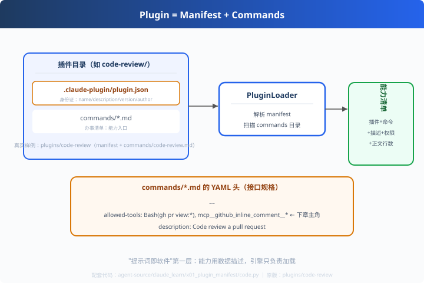

# x01: 插件结构 — manifest + commands

> 对应原版：`plugins/code-review/`（.claude-plugin/plugin.json + commands/）
> 上一步：无（claude_learn 第一课）｜ 下一步：[x02 allowed-tools](../x02_allowed_tools/)
> *"能力用数据描述，引擎只负责加载——这是'提示词即软件'的第一层。"*

---

## 问题

"一切能力来自插件"——那插件到底长什么样？claude-code 的答案：**两件套**。

---

## 方案



```
插件目录/
├── .claude-plugin/plugin.json     ← 身份证（name/description/version/author）
└── commands/*.md                  ← 办事清单（YAML 头 + 提示词剧本）
```

---

## 原理（读 code.py）

### 第 1 步：manifest（身份证）

```python
PLUGIN_MANIFEST = {
    "name": "code-review",
    "description": "Automated code review for pull requests...",
    "version": "1.0.0",
    "author": {"name": "Boris Cherny", ...},      # ← 真实样例
}
```

### 第 2 步：commands（办事清单）

```python
def parse_yaml_header(md):
    # --- ... --- 之间 = YAML 头：allowed-tools / description
    # 正文 = 多步剧本（交给 x03 调度）
```
命令的**权力边界**（allowed-tools）声明在 YAML 头——这是"提示词即软件"的第一层。

### 第 3 步：加载器要输出什么

| 字段 | 用途 |
|---|---|
| description | 命令是干什么的（模型/用户读取） |
| allowed_tools | 权限清单（x02 主角） |
| body | 提示词剧本（x03 主角） |

---

## 代码走读

- `PLUGIN_MANIFEST` / `COMMAND_MD`：真实样例数据
- `parse_yaml_header()`：YAML 头解析（约 15 行，全章核心）
- `PluginLoader.load()`：manifest + commands → 能力清单
- `__main__`：打印加载结果（插件/命令/权限/正文行数）

调用链：`manifest + commands → 解析 YAML 头 → 能力清单`

---

## 试一下

```bash
python agent-source/claude_learn/x01_plugin_manifest/code.py
# 插件      : code-review v1.0.0（作者 Boris Cherny）
# 命令      : code-review → 描述/权限(条)/正文行数
```

---

## 练习

1. **加命令**：往 commands 里加第二个 md，看 loader 输出 2 条能力
2. **换真实插件**：去 claude-code/plugins/ 挑一个插件，用 loader 解析它的命令
3. **写自己的插件**：给"简历匹配"场景写 manifest + 一个命令（供 x05 用）
4. **破坏测试**：YAML 头缺行时解析器的容错
5. **对比 s02 registry**：claude 用"文件即注册"，s02 用"装饰器即注册"——两种注册方式

---

## 自测问答

**Q：为什么 manifest 和 commands 分离？**
A：manifest 给"市场/管理"用（列表、版本、作者），commands 给"执行引擎"用（怎么跑）。关注点分离，插件可索引可分发。

**Q：commands 的 YAML 头是什么？**
A：接口规格——description（干什么）、allowed-tools（能用什么）。正文是执行逻辑（自然语言剧本）。与传统软件一致，只是"实现"换成了提示词。

**Q：加一个插件要写代码吗？**
A：不用。放一个目录 + 两个文件就注册完（x05 会演示 `/命令` 触发）。

---

## 延伸

- x05：命令作为 CLI 能力入口（/命令）
- x06：插件引擎把这一层串起来