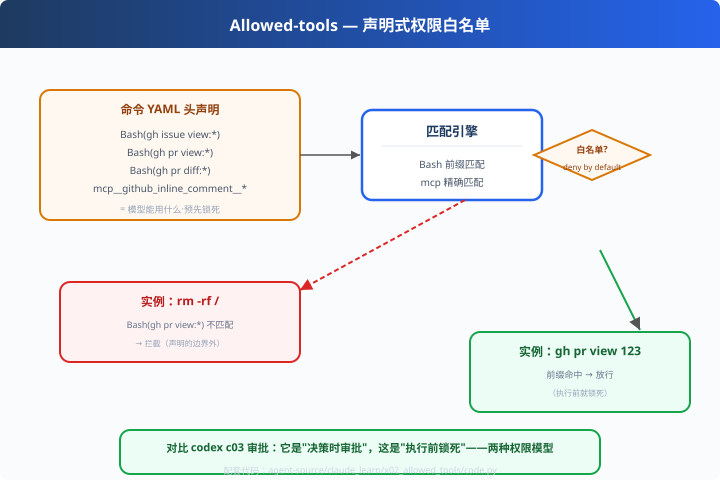

# x02: allowed-tools — 声明式权限白名单

> 对应原版：`plugins/*/commands/*.md` 的 YAML 头（真实样例见 code-review.md）
> 上一步：[x01 插件结构](../x01_plugin_manifest/) ｜ 下一步：[x03 多 Agent 剧本](../x03_playbook/)
> *"权限最小化：模型能用什么，由命令头显式声明。"*

---

## 问题

模型有了工具，凭什么用哪个？claude-code 的答案在**命令头部**：
不是运行时审批，而是**声明式边界**——预先锁死，执行前就确定。

---

## 方案（真实格式）



```yaml
allowed-tools: Bash(gh issue view:*), Bash(gh pr view:*),
               mcp__github_inline_comment__create_inline_comment
```
- `Bash(gh pr view:*)`：允许 bash，且命令以 `gh pr view` 开头（`:*` = 任意后缀）
- `mcp__server__tool`：允许调用 MCP 服务器上某个精确工具
- 白名单之外 = 一律拒绝（**deny by default**）

---

## 原理（读 code.py）

### 第 1 步：规则模型（Bash 前缀 / mcp 精确）

```python
@dataclass
class BashRule:
    arg_prefix: str      # "gh pr view"
    def matches(self, cmd):
        return cmd.startswith(self.arg_prefix)

@dataclass
class McpRule:
    tool_name: str
    def matches(self, tool): return tool == self.tool_name
```

### 第 2 步：解析声明

```python
def parse_allowed_tools(line):
    # "Bash(gh pr view:*), mcp__x__y" → [BashRule, McpRule]
```

### 第 3 步：deny by default

```python
def check(policy, kind, value):
    # bash: 前缀匹配；mcp: 精确匹配；其余：返回 False（拒绝）
    return ok, hit
```

---

## 代码走读

- `BashRule / McpRule`：规则数据类
- `parse_allowed_tools()`：声明 → 规则集（约 20 行，全章核心）
- `check()`：匹配（deny by default）
- `__main__`：6 条命令 vs 真实白名单 → 放行/拦截对照

调用链：`声明 → 解析规则 → 每条命令前缀/精确匹配 → 放行 or 拦截`

---

## 试一下

```bash
python agent-source/claude_learn/x02_allowed_tools/code.py
# ✅ [bash] gh pr view 123    -> 命中前缀
# ✅ [bash] gh issue view 5   -> 另一个前缀
# 🚫 [bash] gh label create   -> 不在名单
# 🚫 [bash] rm -rf /          -> 完全无关
# ✅ [mcp ] github_inline_comment/create_inline_comment -> 精确命中
```

---

## 练习

1. **加规则**：`Bash(git status)`（无 `:*`——只能跑原样命令）——体验"精确 vs 前缀"差别
2. **给 mcp 加粗细粒度**：`mcp__server__*`（server 级通配）
3. **写工具**：把匹配引擎接到一个"筛选模型工具表"的函数（把非白名单工具直接不下发）
4. **集成 x06**：引擎的 authz 层就是本实现
5. **对比 c03**：allowed-tools 与 approvals 各适合什么场景（限时还是预锁）

---

## 自测问答

**Q：allowed-tools 和 codex approvals 的区别？**
A：approvals 是**决策时**审批（执行瞬间人/策略决定）；allowed-tools 是**执行前**锁死（命令级白名单）。前者活、后者严——claude 用声明式，因为它的是"固定剧本"命令。

**Q：`:*` 通配会不会太宽松？**
A：在可控范围：`gh pr view 123` 只会查 PR，危害面小。通配的边界 = 你对该工具子命令的信任度；高危子命令不开通配。

**Q：白名单之外模型能绕吗？**
A：不能。工具表从声明生成——模型根本看不到白名单外的工具（比"事后拦截"更彻底）。

---

## 延伸

- x04：白名单之外的"过程式"防线——hooks（改写/拦截）
- codex c03：动态审批模型，对比阅读