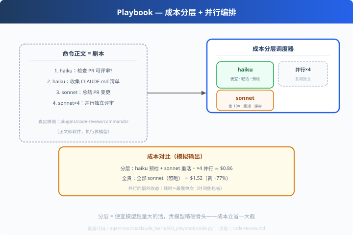

# x03: 多 Agent 剧本 — 成本分层编排

> 对应原版：`plugins/code-review/commands/code-review.md`（真实多步剧本）
> 上一步：[x02 allowed-tools](../x02_allowed_tools/) ｜ 下一步：[x04 hooks](../x04_hooks/)
> *"便宜模型趟量大的活，贵模型啃硬骨头——分层是花钱的艺术。"*

---

## 问题

一个命令的正文就是一份"剧本"：先派谁、并行几个、谁汇总。
claude 的真实剧本（code-review）前几步：

```
1. Launch a haiku agent to check if the PR is reviewable.
2. Launch a haiku agent to list relevant CLAUDE.md files.
3. Launch a sonnet agent to view the PR and summarize changes.
4. Launch 4 agents in parallel to independently review the changes.
```

---

## 方案



**成本分层 + 并行**：

| 模型 | 角色 | 相对成本 |
|---|---|---|
| haiku | 预检 / 摘要（轻活） | 1×（便宜） |
| sonnet | 分析 / 评审（重活） | ~10×（贵） |

**便宜模型撑量、贵模型精投**。

---

## 原理（读 code.py）

### 第 1 步：解析剧本

```python
def parse_playbook(text):
    # "Launch a <model> agent to <task>" → (model, task, 1)
    # "Launch N agents in parallel ..."  → (sonnet, task, N)
```

### 第 2 步：分层调度 + 并行执行

```python
def run(parallel=True):
    for model, task, cnt in steps:
        if parallel and cnt > 1:
            # 线程池并发（结果汇总）
        else:
            # 单个执行
```

### 第 3 步：成本统计

```python
cost = tokens / 1000 * MODELS[model]["price_per_1k"]
```
输出"分层成本 vs 全贵成本"的对比——让省钱说得出口。

---

## 代码走读

- `MODELS`：价格/速度表（haiku vs sonnet）
- `parse_playbook()`：剧本解析（约 20 行，全章核心）
- `execute_step()`：模拟一次 agent 干活（耗时∝speed）
- `run()`：分层调度 + 统计
- `__main__`：分层 vs 全贵的成本对比

调用链：`剧本 → 解析 → 分层/并行执行 → 成本统计`

---

## 试一下

```bash
python agent-source/claude_learn/x03_playbook/code.py
# haiku ×1 预检  cost≈$0.030（轻活）
# sonnet ×4 并发评审 cost≈$0.396
# 分层成本 vs 全贵成本 → 节省 N%
```

---

## 练习

1. **改剧本**：把第 1 步 haiku 换成 sonnet，看成本跳多少
2. **加 opus 层**：三档模型（最贵一层做最后汇总决策）
3. **串行依赖**：评审必须等摘要——加依赖约束（像 c02 的讨论）
4. **把剧本写进文件**：从真实 code-review.md 读剧本解析（关掉内置，读真文件）
5. **时间也统计**：分层 vs 全贵的"耗时"对比（并行已帮你降耗时）

---

## 自测问答

**Q：为什么贵模型不做预检？**
A：预检是"值不值得继续"的二值判断，haiku 足够且便宜 10 倍；大头的分析交给 sonnet。成本分层=LLM 版"粗筛细审"。

**Q：并行评审的意义？**
A：N 个 agent 各自独立看同一份 diff → 减少单点盲区，耗时≈单次最慢（配合 c02/p03 的并行思想）。

**Q：和 codex c07 的转场控制区别？**
A：codex 用代码控制谁先谁后（control.rs）；claude 用**提示词剧本**声明（模型自主执行）。声明式省工程、代码式更确定——各自的取舍。

---

## 延伸

- x06：剧本放进插件引擎执行
- codex c07 / d05：另两种多 Agent 组织方式，三种对比记一页