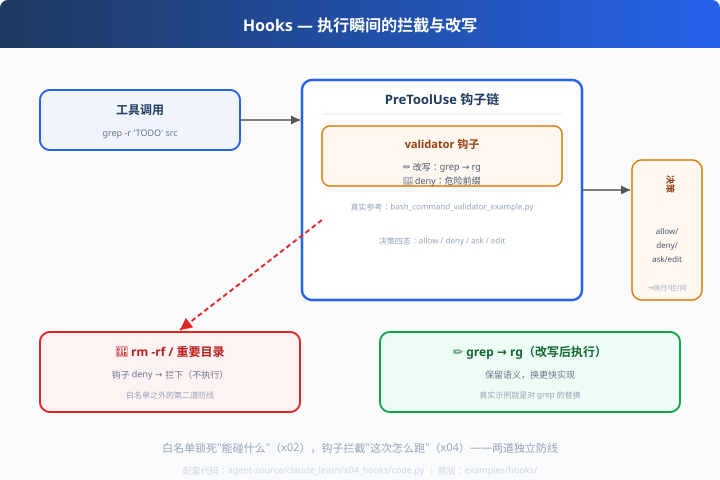

# x04: Hooks — 执行瞬间的拦截与改写

> 对应原版：`examples/hooks/bash_command_validator_example.py`（真实 Python 钩子）
> 上一步：[x03 多 Agent 剧本](../x03_playbook/) ｜ 下一步：[x05 命令解析器](../x05_commands/)
> *"白名单管'能碰什么'，钩子管'这次怎么跑'——两道独立防线。"*

---

## 问题

allowed-tools 是"声明式边界"（x02），但有些事只能**执行瞬间**判断：
这条命令今天不能跑、这个仓库路径要特殊处理、这条 grep 可以优化成 rg。
静态白名单做不到的"动态判断"，交给**钩子**。

---

## 方案



```
工具调用 → PreToolUse 钩子链 → 放行/改写/拒绝/询问 → 执行
```
决策四态：`allow`（放行）/ `deny`（拒绝）/ `ask`（问用户）/ `edit`（改写后执行）。

---

## 原理（读 code.py）

### 第 1 步：钩子实现（改写 + 拦截）

```python
def validator_hook(evt):            # 参考真实 bash_command_validator 示例
    if evt.command.startswith("grep "):
        return HookDecision("edit", "更快的替代",
                            evt.command.replace("grep ", "rg ", 1))   # 改写
    if evt.command.startswith("rm -rf /"):
        return HookDecision("deny", "危险命令")                          # 拒绝
    return HookDecision("allow")                                        # 放行
```

### 第 2 步：多钩子串联

```python
def run_hooks(hooks, evt):
    final = HookDecision("allow")
    for hook in hooks:
        d = hook(evt)
        if d.action == "deny": return d     # deny 优先
        if d.action == "edit": final = d    # 记录最后一次改写
    return final
```
**deny 优先级高于 edit/allow**——安全永远第一。

---

## 代码走读

- `ToolUseEvent` / `HookDecision`：事件与决策（数据类）
- `validator_hook` / `audit_hook`：两个示例钩子（拦截 + 审计）
- `run_hooks()`：串联与优先级（约 15 行，全章核心）
- `__main__`：grep（改写）/ rm -rf /（拒绝）/ git status（放行）

调用链：`工具调用 → 钩子链(deny优先) → 决策 → 执行/拦/改`

---

## 试一下

```bash
python agent-source/claude_learn/x04_hooks/code.py
# ✏️ grep -r 'TODO' src  -> [edit] 执行：rg -r 'TODO' src
# 🚫 rm -rf / 重要目录     -> [deny] 危险命令
# ✅ git status           -> [allow]
```

---

## 练习

1. **加 ask 态**：危险度中的命令 → ask（模拟等待用户 y/n）
2. **改 audit**：把 audit_hook 升级为"记录时间+命令+决策"的审计日志
3. **链式改写**：两个 edit 钩子叠加（先 trim 再替换）
4. **接 x06**：钩子层进引擎（authz 之后、执行之前）
5. **对比 d02**：claude 钩子挂"工具调用"；deepseek 挂"循环 pre-step"——分层差异

---

## 自测问答

**Q：钩子决策有哪几种？**
A：allow / deny / ask / edit（改写）。真实 claude hooks 四种全支持；`ask` 就是"过程式审批"，与 codex approvals 同思想。

**Q：白名单和钩子谁先跑？**
A：先白名单（静态边界，成本低），再钩子（动态决策）。引擎里顺序固定：authz → hook → 执行。

**Q：钩子能审计吗？**
A：能。执行前后各挂一道（Pre/PostToolUse），Post 记录结果——全链路可观测（x06 的审计日志）。

---

## 延伸

- x06：引擎集成 authz + hook + audit 四层
- deepseek d02：waterfall 插件链（另一个"钩子"实现，挂在循环上）