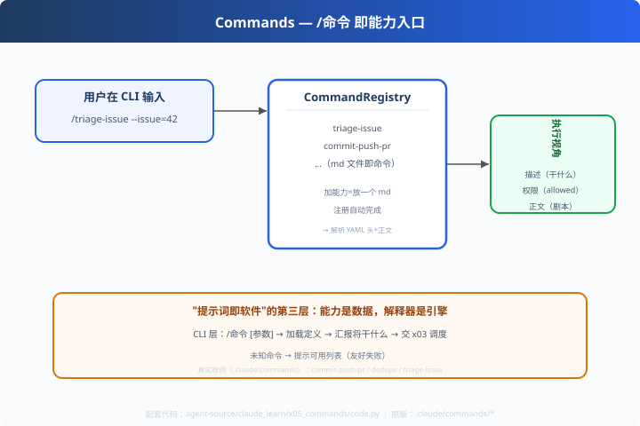

# x05: 命令解析器 — /命令 即能力入口

> 对应原版：`.claude/commands/`（commit-push-pr / dedupe / triage-issue 真实样例）
> 上一步：[x04 hooks](../x04_hooks/) ｜ 下一步：[x06 综合引擎](../x06_comprehensive/)
> *"加能力 = 放一个 md 进 commands 目录。注册自动完成。"*

---

## 问题

用户怎么触发一个剧本？claude 的答案是：**命令**——`/review`、`/commit-push-pr`。
一个 md 文件 = 一个命令 = 一个能力入口。

---

## 方案



```
commands/triage-issue.md  →  注册 /triage-issue
  ├─ YAML 头：description + allowed-tools（接口规格）
  └─ 正文：多步剧本（执行逻辑）
```

---

## 原理（读 code.py）

### 第 1 步：命令注册表（md 即注册）

```python
class CommandRegistry:
    def __init__(self, sources):
        for name, md in sources.items():
            header = parse_yaml_header(md)   # 解析 YAML 头
            self.parsed.append({name, description, allowed_tools, body})
```

### 第 2 步：CLI 触发

```python
def invoke(registry, cmd, args=""):
    c = registry.find(cmd.lstrip("/"))
    # 汇报：描述 / 权限 / 正文首行 → 交给 x03 调度
```

### 第 3 步：友好失败

```python
except KeyError:
    print(f"❌ 未知命令 /{name}，可用：{registry.list()}")
```

---

## 代码走读

- `COMMANDS_MD`：真实样例（triage-issue / commit-push-pr 的头部）
- `CommandRegistry`：加载/查找/清单（约 20 行，全章核心）
- `invoke()`：/命令 → 加载 → 汇报
- `__main__`：三个调用（含未知命令 → 友好提示）

调用链：`/命令 [参数] → registry.find → 展示接口规格 → 交剧本（x03）`

---

## 试一下

```bash
python agent-source/claude_learn/x05_commands/code.py
# [CLI] 用户输入：/triage-issue --owner=octo/repo --issue=42
#   ✅ 已加载命令 /triage-issue → 描述/权限/正文首行
# 🚫 未知命令 /nope → 可用：['triage-issue', 'commit-push-pr']
```

---

## 练习

1. **加第 3 个命令**：给你的匹配场景写 md（复 x01 练习的成果）
2. **参数透传**：把 `--issue=42` 解析进 args 传给剧本
3. **命令别名**：`/r` = `review`（注册表加 alias 字段）
4. **安全回顾**：给命令校验 allowed-tools 后再 load（x02 联动）
5. **接 x06**：命令在引擎里被执行（含白名单+钩子+审计）

---

## 自测问答

**Q：加一个新命令要改代码吗？**
A：不用。往 commands 目录放一个 md 即注册完成（插件式）。这就是"提示词即软件"：**能力是数据，解释器是通用引擎**。

**Q：YAML 头和传统 CLI 的 --help 有什么关系？**
A：等价物。description = usage 摘要；allowed-tools = capabilities；正文 = 执行体（提示词剧本）。

**Q：命令与插件的关系？**
A：插件 = manifest + commands（x01）；命令是引擎的"能力入口"，插件是"能力打包"。一对多。

---

## 延伸

- x01：命令来自插件 commands 目录（组合关系）
- x06：命令在引擎里被真正执行——收官