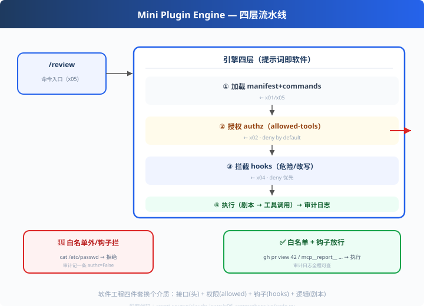

# x06: 综合 — 迷你插件引擎（提示词即软件的完整链路）

> 前五步合体：manifest(x01) → allowed-tools(x02) → 剧本(x03) → hooks(x04) → 命令(x05)
> 上一步：[x05 命令解析器](../x05_commands/) ｜ **claude_learn 收官**
> *"软件工程四件套换了个介质：接口规格、权限、钩子、逻辑。"*

---

## 一张图看懂 claude 插件体系（读 code.py 主流程）



```
用户输入 /review
   │
   ▼
① 加载（manifest + commands）      ← x01/x05
② 授权（authz：allowed-tools）     ← x02   deny by default
   │  未授权 → 拒绝（审计记一条）
   ▼
③ 拦截（hooks：危险/改写）         ← x04
   │  拒绝 → 拦下（审计记一条）
   ▼
④ 执行（剧本调度 x03） → 审计日志  ← 全链路可观测
```

---

## 原理（读 code.py）

### 四层职责分离（自测问答的答案）

| 层 | 负责 | 对应前面 |
|---|---|---|
| 加载 | 能力从哪来 | x01/x05 |
| 授权 | 能不能用（静态） | x02 |
| 拦截 | 这次该怎么用（动态） | x04 |
| 执行 | 到底怎么跑 | x03 |

### 审计贯穿（每个决策都可查）

```python
self.log.append({"step": ..., "authz": bool, "hook": "deny/allow"})
```
**audit 是四层之外的水位线**——出了问题知道卡在哪一层。

---

## 代码走读

- `parse_allowed()`：白名单解析（复用 x02 精简版）
- `Engine._authz()` / `_hook()` / `run()`：四层主流程（约 40 行，全章核心）
- 内置 `review-bot` 插件（manifest + 命令 + allowed + 剧本）
- `__main__`：5 个调用跑全链路 + 审计日志输出

调用链：`/命令 → ① 加载 → ② authz → ③ hook → ④ 执行 → 审计`

---

## 试一下

```bash
python agent-source/claude_learn/x06_comprehensive/code.py
# ✅ Bash(gh pr view 42)     authz=True  hook=allow
# 🚫 Bash(cat /etc/passwd)   不在白名单 → 拒绝
# ✅ mcp__report__writemarkdown authz=True
# 审计日志（authz/hook 每步可查）
```

---

## 练习

1. **加第 5 层**：PostToolUse（执行后审计）——四层变五层
2. **换插件**：给引擎注册第二个插件（不同 allowed），体验"换帽子"
3. **审计上报**：把 log 接到 p01 的事件流（遥测联动）
4. **权限最小化复查**：给 review 命令删掉一条 allowed，看哪次调用被拦
5. **全家福复盘**：用一张白板画出 x01~x06 在引擎里的位置

---

## 自测问答

**Q："提示词即软件"到底指什么？**
A：用工程四件套做 Agent 能力：接口规格（YAML 头）、权限（allowed-tools）、钩子（hooks）、逻辑（剧本）。**实现介质是提示词，但工程纪律一件不少。**

**Q：为什么 claude 的核心闭环是"数据 + 引擎"而不是"每种需求一段代码"？**
A：需求千变万化，循环与权限是共性的。把共性的做进引擎（加载/授权/拦截/执行），把变化的做成命令（剧本）——**一套引擎，无数能力**。

**Q：和 deepseek 的"一切皆插件"对比？**
A：同思想不同挂载点：deepseek 把钩子挂在**循环的每一步**（d02），claude 把钩子挂在**工具调用瞬间**（x04）。前者改"推理过程"，后者改"执行动作"。

---

## 收官：claude_learn 全家福

| x01 插件结构 | x02 白名单 | x03 剧本 | x04 hooks | x05 命令 | x06 引擎 |
| --- | --- | --- | --- | --- | --- |
| 数据即能力 | 执行前锁死 | 分层编排 | 瞬间拦截 | 入口即注册 | 四层流水线 |

## 🎉 四家教学全系完成（37 步）

| learn-mini-agent s01~s10 | codex_learn c01~c07 | deepseek_learn d01~d07 | pi_learn p01~p07 | claude_learn x01~x06 |
| --- | --- | --- | --- | --- |
| 手写框架 | 工程外壳 | 可插拔架构 | 事件驱动 | 提示词生态 |

- 总览：[agent-source 索引](../README.md) ｜ 学习地图：[LEARNING_MAP](../../LEARNING_MAP.md) ｜ 一键回归：[check_all](../../scripts/check_all.py)