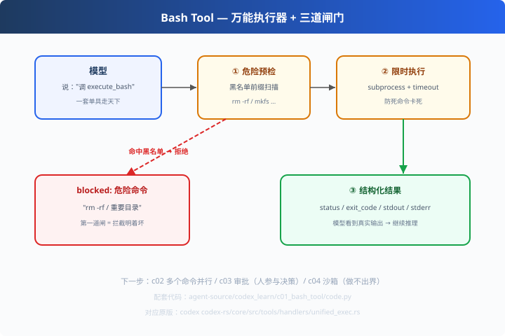

# c01: Bash 即工具 — codex 的第一性原理

> 对应原版：`codex-rs/core/src/tools/handlers/unified_exec.rs`｜ 下一步：[c02 并行工具](../c02_parallel_tools/)
> *"Bash is all you need" — 给模型一个 shell，等于给了它全世界。*

---

## 问题

给 Agent 十个专用工具（read_file、search、write…），它仍会碰到"工具外"的需求：
跑测试、装依赖、查 git 历史、启动服务、管道组合……

专用工具是**你（设计者）想象的边界**；而 Bash 是**能力全集**——
能跑任意程序、访问任意文件、组合任意命令。

codex 的原话哲学：**"Bash is all you need"**——通用执行能力 > 一堆专用工具。

---

## 方案



一个 `execute_bash(command)` 工具 + 三道闸门：

```
① 危险预检（黑名单）→ ② 限时执行（timeout）→ ③ 结构化结果（回填模型）
```

---

## 原理（读 code.py）

### 第 1 步：危险预检（第一道闸）

```python
DANGEROUS = ["rm -rf /", "mkfs", "dd if=", "shutdown", ":(){ :|:& };:"]
for bad in DANGEROUS:
    if command.strip().startswith(bad):
        return {"status": "blocked", "reason": f"危险命令：{bad}"}
```
注意：这是**前缀黑名单**——生产中它只是最外层，真正的隔离靠 c04 沙箱 + c03 审批。

### 第 2 步：限时执行（第二道闸）

```python
proc = subprocess.run(command, shell=True, capture_output=True,
                      text=True, timeout=self.timeout)
```
`timeout` 防死命令；`capture_output` 把 stdout/stderr 抓回来给模型（防丢信息）。

### 第 3 步：结果结构化（给模型看的）

```python
{"status": "ok", "exit_code": 0, "stdout": "...", "stderr": "..."}
```
**模型看到真实输出才能继续推理**——这是"看得见的 Agent"的基础。
`exit_code≠0` 时的 stderr 就是模型自愈的诊断信息（配合 s09）。

---

## 代码走读

- `BashTool.execute()`：预检 → 限时执行 → 结构化返回（约 20 行，全章核心）
- `DemoLLM`：脚本模型，两步走（跑 python 算数 → 列目录）
- `run_agent()`：最小循环（复 s01），工具换成 Bash
- `__main__`：两步演示 + 危险预检对比（rm -rf 被拦 / echo 放行）

调用链：`模型要 bash → 预检 → subprocess → 结构化 JSON → 回填 messages`

---

## 试一下

```bash
python agent-source/codex_learn/c01_bash_tool/code.py
# [agent] step 1: bash "python -c ...sqrt(144)" → ok
# [agent] step 2: bash "echo hello && ls"      → ok
# 危险预检演示：rm -rf / 重要目录 → blocked
```

---

## 练习

1. **加黑名单**：把 `git push --force` 加进 DANGEROUS，观察拦截
2. **体验 shell 注入面**：改参数让模型执行 `calc; rm -f x`，讨论为什么需要 c03/c04
3. **加白名单模式**：改成"默认拒绝 + 显式放行"（预演 c04 沙箱）
4. **返回优化**：把 stdout 截断成前 200 字符，给模型标注"已截断"
5. **对比 unified_exec**：打开 codex 源码 handlers/，看它在 pre-exec 阶段做了几层检查

---

## 自测问答

**Q：为什么 codex 主打 "Bash is all you need"？**
A：专用工具是"设计者想象力的边界"，Bash 是"能力的全集"。代价是安全风险大——所以必须配审批（c03）与沙箱（c04）。

**Q：工具输出怎么给模型？**
A：结构化 JSON（status/exit_code/stdout/stderr）回填 tool 消息。模型据此判断下步动作，出错时 stderr 就是诊断。

**Q：shell=True 为什么不安全？**
A：shell 会解析管道/重定向/子 shell，注入面更大。生产作法：`execvp` 免 shell、参数数组传参、进沙箱（c04）。

---

## 延伸

- c02：多个命令怎么并行跑（两阶段）
- c03：危险命令走审批（人/策略在决策环里）
- c04：真沙箱（默认拒绝 + 显式放行）
- 关联 learn-mini-agent s09：错误回传自愈与这里的结构化 stderr 是一套闭环