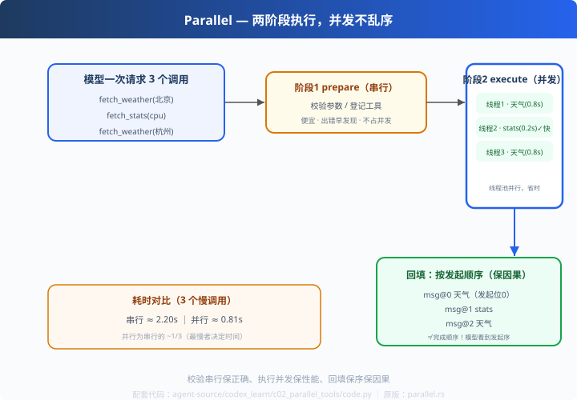

# c02: 工具并行执行 — 两阶段 + 回填保序

> 对应原版：`codex-rs/core/src/tools/parallel.rs` ｜ 同款：pi 的 `types.ts` ToolExecutionMode
> 上一步：[c01 Bash 工具](../c01_bash_tool/) ｜ 下一步：[c03 审批流](../c03_approvals/)
> *"并发只影响速度，绝不破坏因果。"*

---

## 问题

模型一次请求 3 个工具调用（查北京天气、查 cpu、查杭州天气）。怎么办？
- 串行执行：2.2s，太慢
- 直接全并发：得快，但**结果乱序**——模型看到的"天气=cpu 数据"，推理全乱

顺序问题的本质：**Agent 的因果链必须按模型发起顺序，而不是执行完成顺序。**

---

## 方案



**两阶段执行**：

```
阶段1 prepare（串行）：校验参数、准备环境  —— 便宜，出错早暴露
阶段2 execute（并发）：真正耗时的操作      —— 线程池，互不阻塞
回填：结果按【发起顺序】排列             —— 因果不乱
```

---

## 原理（读 code.py）

### 第 1 步：prepare 串行校验（早失败）

```python
for c in calls:
    if name not in TOOL_TABLE:
        prepared.append({"error": f"未知工具 {name}"})   # prepare 阶段就拦住
    else:
        prepared.append({"args": json.loads(arguments)})
```
传错参数的调用在**并发前**就被拦住，不浪费线程。

### 第 2 步：execute 并发执行

```python
with ThreadPoolExecutor(max_workers=4) as pool:
    futures = {}
    for i, p in enumerate(prepared):
        futures[pool.submit(func, **p["args"])] = i      # 每个工具一个线程
    for fut in as_completed(futures):
        idx = futures[fut]                                # 谁先完成谁落位
        results[idx] = ...
```
`as_completed` 按完成顺序遍历，但写入按 **index 对齐**——并发内部完成次序自由，
对外仍是"按编号落位"。

### 第 3 步：回填保序（关键）

```python
return [results[i] for i in range(len(prepared))]         # 按发起顺序输出
```
别小看这一行：**输出顺序 = 发起顺序，完成顺序再乱也不影响模型看到的因果链。**

---

## 代码走读

- `TOOL_TABLE`：工具注册表（name → func/arg_names）
- `ParallelExecutor.execute_many()`：prepare→execute→保序回填（约 30 行，全章核心）
- `DemoLLM`：一次请求 3 个调用（含两个同名工具）
- `__main__`：并行 0.81s vs 串行 2.20s 对比 + 顺序输出验证

调用链：`3 个调用 → prepare 串行校验 → 线程池并发 → index 对齐 → 发起序回填`

---

## 试一下

```bash
python agent-source/codex_learn/c02_parallel_tools/code.py
# [agent] step 1: 模型请求 3 个并行调用: ['fetch_weather','fetch_stats','fetch_weather']
# [agent] step 1: 并行执行耗时 0.81s
#     - fetch_weather -> ...（发起序 #0）
#     - fetch_stats   -> ...（发起序 #1）
# [对比] 串行耗时：2.20s（并行约为其一半）
```

---

## 练习

1. **加依赖场景**：让工具 B 依赖 A 的结果——讨论为什么"全并行"在这时要用依赖图
2. **改线程池**：max_workers=2 观察耗时变化（并发度 vs 资源）
3. **注入异常**：让某个工具抛异常，观察 results[idx] 错误落位、整体不崩
4. **加超时**：`concurrent.futures.wait(..., timeout)`，慢工具超时不阻塞收尾
5. **对比 pi p03 双轨**：codex 只保消息序；pi 还多一个"完成序事件轨"——讲讲各自适用

---

## 自测问答

**Q：并行执行工具，怎么保证消息顺序？**
A：结果容器按 index 对齐（results[i]），最后按发起序统一输出。**并发只影响速度，不影响因果。**

**Q：为什么不全部并发？**
A：工具间可能有依赖（B 要用 A 的结果）；并发有资源上限（线程/连接/限流）。两阶段留了串行口子，未来可加依赖图（拓扑排序）。

**Q：线程隔离够吗？**
A：线程共享进程状态，发现问题成本高。codex 的并行工具走 exec-server（进程级 IPC）；这里用线程只为演示"并发+保序"的骨架。

---

## 延伸

- c03：并行来的危险命令，审批怎么接——位置在 prepare 之后、execute 之前
- pi_learn p03：pi 的双轨（完成序事件 + 发起序消息），对比理解