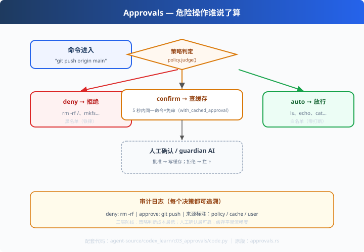

# c03: 审批流 — 危险操作谁说了算

> 对应原版：`codex-rs/core/src/tools/approvals.rs`（35KB）`exec_policy.rs`
> 上一步：[c02 并行工具](../c02_parallel_tools/) ｜ 下一步：[c04 沙箱](../c04_sandbox/)
> *"黑名单是规则漏了=事故；审批是规则没覆盖的交给人在决策环里判。"*

---

## 问题

黑名单永远漏：`rm -f ~/important` 不在黑名单里，但同样致命。
c01 的预检挡住"明着坏"，挡不住"看起来合理但后果严重"的操作。
**静态规则防不住的事，需要"人/策略在决策环里"。**

---

## 方案



**审批漏斗**：三路分流 + 缓存加速 + 全程审计。

```
命令 → 策略判定(auto/confirm/deny)
        ├─ deny（黑名单）  → 拦
        ├─ auto（白名单）  → 放行，零打断
        └─ confirm（未知） → 查缓存（短时免审）→ 人工/guardian 批准或拒绝
```

---

## 原理（读 code.py）

### 第 1 步：策略判定

```python
class ApprovalPolicy:
    def judge(self, command):
        if startswith(黑名单):  return "deny"
        if startswith(白名单):  return "auto"
        return "confirm"          # 未知 = 保守确认
```
**白名单放行（零打断）、黑名单拒绝（铁律）、其余一律确认（保守）**。

### 第 2 步：缓存审批（codex 的 with_cached_approval）

```python
h = md5(cmd).hexdigest()[:8]
if h in cache and now < cache[h]:      # 5 秒内同一命令
    return True, "缓存免审", "cache"
```
为什么有价值？Agent 高频重复调用同一命令（反复 `git push`）时，每次都弹窗=体验灾难。
短时缓存 = 安全与流畅的平衡点。

### 第 3 步：决策来源标注（可追溯）

```python
("deny", c, "policy")   # 策略拒绝
("approve", c, "user")  # 人工批准
("approve", c, "cache") # 缓存免审
```
**每个决策都带来源**——审计日志不是黑盒，出了问题知道该查哪一环。

---

## 代码走读

- `ApprovalPolicy.judge()`：三类判定（约 15 行）
- `ApprovalFlow.should_run()`：漏斗主流程（缓存→人工→审计）
- `hashlib.md5`：命令指纹（缓存键）
- `__main__`：6 条命令跑全流程 + 审计日志展示（user 模式下假批准）

调用链：`命令 → judge → deny/auto 直返 or confirm(缓存/人工) → 审计落日志`

---

## 试一下

```bash
python agent-source/codex_learn/c03_approvals/code.py
# ✅ ls -la                    ← 白名单放行（policy）
# ❌ rm -rf / 重要目录           ← 黑名单拒绝
# ✅ git push origin main      ← 首次 confirm → 批准+写缓存
# ✅ git push origin main      ← 同一命令 → 缓存免审（cache）
```

---

## 练习

1. **开/关缓存**：`cache_ttl=0` 观察"不再免审"、`auto_approve=False` 观察"全部拒绝"
2. **加限时批准**：改成"批准一次有效 30s 且只限本次会话"（比全局缓存更细）
3. **guardian AI**：往人工确认前插一个"生成批准理由"的模拟步骤（codex guardian 的做法）
4. **权限分级**：把 confirm 再拆成"只读确认/写确认/网络确认"三档
5. **集成**：把 ApprovalFlow 接进 c02 的 execute_many（prepare 之后、execute 之前）

---

## 自测问答

**Q：审批流和黑名单的区别？**
A：黑名单"规则漏了=事故"；审批"规则没覆盖的交给人在决策环里判"。codex 是策略 + guardian AI 审查 + hooks 自定义决策三层。

**Q：headless/CI 场景怎么办？**
A：hooks 可配置成自动批准/拒绝（如仅白名单命令）。codex 有 permission hooks，CI 里零打断。

**Q：审批会拖慢 Agent 吗？**
A：会。所以白名单自动放行 + 短时缓存免审两个机制把延迟压到最低；只有"真正危险的未知操作"才需要人。

---

## 延伸

- c04：审批通过后，命令还在沙箱里执行——两道**独立**防线
- claude_learn x02：allowed-tools 的"声明式边界"是另一种权限模型，对比学习