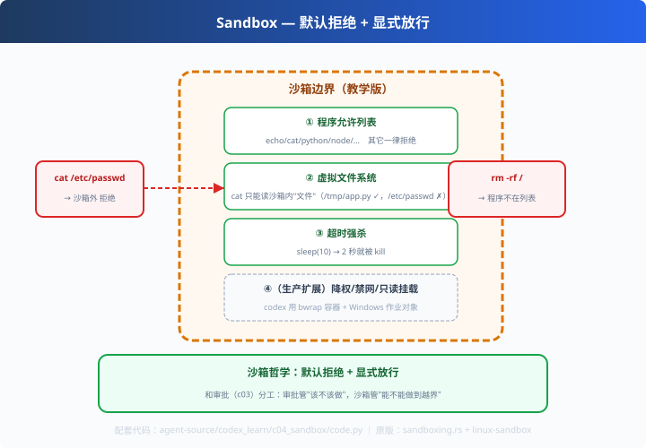

# c04: 沙箱 — Agent 的"无菌操作室"

> 对应原版：`codex-rs/core/src/sandboxing.rs`、`linux-sandbox/`（bwrap）、`windows-sandbox-rs/`
> 上一步：[c03 审批流](../c03_approvals/) ｜ 下一步：[c05 上下文压缩](../c05_context_compaction/)
> *"光靠检查命令文本 = 把门锁在门口，钥匙还在屋里。"*

---

## 问题

c01 预检 + c03 审批挡得住"明着坏"，挡不住"偷着坏"：
命令文本没问题，但它可能读了你不想给的文件、写坏系统目录、偷偷连外网。
**检查命令永远有缝隙**——真正可靠的是让它在一条"边界"里跑。

---

## 方案



**沙箱 = 默认拒绝 + 显式放行**：

```
┌──── Agent 进程 ────┐
│     你的代码        │
├──── 沙箱边界 ──────┤
│ 允许列表/虚拟FS/超时 │  ← 命令在这"缩小版环境"里跑
└────────────────────┘
命令能做的事被【物理限制】，而不是靠"劝"。
```

---

## 原理（读 code.py）

### 教学版四道限制

```python
# ① 程序白名单（codex 真实版用 bwrap 做系统级隔离）
if prog not in ALLOWED_COMMANDS:
    return {"status": "blocked", "reason": "程序不在沙箱允许列表"}

# ② 虚拟文件系统：cat 只能看到沙箱内的"文件"
if path not in SANDBOX_FS:
    return {"status": "blocked", "reason": "文件不在沙箱内"}   # /etc/passwd 被拦

# ③ 超时强杀
except subprocess.TimeoutExpired:
    return {"status": "timeout", "reason": "超时强杀"}            # sleep(10) 没了

# ④（扩展点）降权 / 禁网络 / 只读挂载 —— 生产必配
```

### 教学版 vs codex 真实版

| 维度 | 教学版 | codex |
|---|---|---|
| 程序限制 | 白名单字符串 | bwrap 非特权容器 |
| 文件系统 | 虚拟字典 | 只读绑定 + 临时写层 |
| 网络 | 未实现 | 默认禁用、按权限开放 |
| 用户权限 | 未实现 | 降权运行 |

---

## 代码走读

- `Sandbox.run()`：允许列表 → 虚拟 FS → 超时（约 25 行，全章核心）
- `SANDBOX_FS`：教学版"虚拟文件系统"（字典模拟）
- `__main__`：6 条命令跑全流程（echo ✓ / cat 沙箱内 ✓ / cat passwd ✗ / rm ✗ / sleep 超时）

调用链：`命令 → 程序白名单 → 虚拟 FS → subprocess+timeout → 结构化结果`

---

## 试一下

```bash
python agent-source/codex_learn/c04_sandbox/code.py
# ✅ echo hello              ✅ cat /tmp/app.py（沙箱内文件）
# 🚫 cat /etc/passwd（沙箱外） 🚫 rm -rf /（白名单外）
# 🚫 python sleep(10)（超时强杀）
```

---

## 练习

1. **加文件**：往 SANDBOX_FS 加两个"文件"，观察 cat 行为
2. **做防逃脱**：让 `python -c "import os; os.system('cat /etc/passwd')"` 被拦（进 offer：程序执行时绕沙箱——生产怎么防？）
3. **加网络模拟**：往沙箱模型里加"允许访问域名列表"
4. **对比 bwrap**：读 codex 的 `linux-sandbox`，看 `--ro-bind` 怎么写"只读挂载"
5. **三层组合**：c01 预检 + c03 审批 + c04 沙箱——画一张"命令进沙箱"的完整流程图

---

## 自测问答

**Q：沙箱和审批什么关系？**
A：两道独立防线。审批是"行为决策"（该不该做），沙箱是"能力限制"（做不出界）——即使审批漏了，沙箱也兜得住。

**Q：沙箱开销大吗？**
A：bwrap 等用户态沙箱毫秒级启动，开销很小；容器/VM 级才大。codex 本地用 bwrap/作业对象，远程执行重活，分级隔离。

**Q：Windows 怎么沙箱？**
A：codex 有 windows-sandbox-rs（作业对象 + ACL）。跨平台是 Agent 沙箱的工程难点，所以 codex 把平台差异封在独立 crate 里。

---

## 延伸

- c05：压缩——沙箱防"做坏事"，压缩防"记不住"
- deepseek_learn 的 sandbox 包：sandbox-local / sandbox-policy / sandbox-windows-acl（另一家的做法）