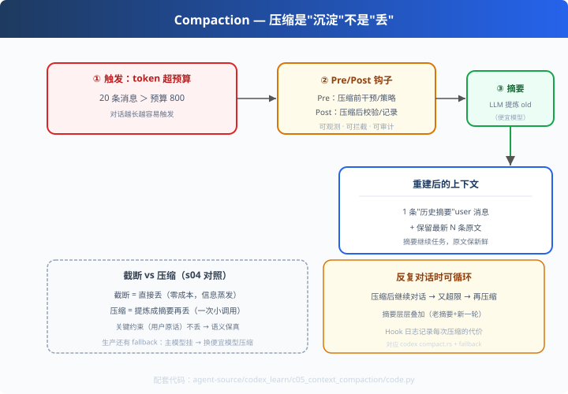

# c05: 上下文压缩 — 截断之上的进化

> 对应原版：`codex-rs/core/src/compact.rs`（30KB）`compact_model_fallback.rs`
> 上一步：[c04 沙箱](../c04_sandbox/) ｜ 下一步：[c06 会话持久化](../c06_session_persistence/)
> *"截断是'丢'，压缩是'沉淀成摘要再丢'。"*

---

## 问题

learn-mini-agent s04 教了窗口截断：超预算就丢最早。
但**丢的可能是关键信息**：用户早期给的约束、前几轮的工具结果、决策依据。
codex 的答案：不丢，**压缩**——把旧内容"提炼成摘要"再丢原文。

---

## 方案



**带钩子的压缩生命周期**：

```
① 触发：token 预算超限
② PreCompactHook：压缩前干预（自定义策略/拦截）
③ LLM 摘要：旧消息 → CompactionSummary（一条）
④ PostCompactHook：压缩后校验/记录
⑤ 兜底：主模型不可用 → 换便宜模型压缩（model fallback）
```

---

## 原理（读 code.py）

### 第 1 步：识别"旧"与"新"

```python
old = messages[:-keep_latest]            # 旧消息 = 待压缩部分
latest = messages[-keep_latest:]         # 最新几条保留原文（语义最新鲜）
summary = summarizer.summarize(old)      # LLM 提炼（教学版用规则模拟）
```

### 第 2 步：重建上下文

```python
ctx.messages = [{"role": "user", "content": f"（历史摘要）{summary} 继续任务"}] + latest
```
摘要进消息流开头，最新 N 条原文保留——**摘要保全局、原文保新鲜**。

### 第 3 步：Hook 化（生产落地的关键）

```python
self.hook_log.append("[PreCompactHook] 触发压缩，当前使用量 X/Y")
self.hook_log.append("[PostCompactHook] 压缩完成：12 条 -> 1 条摘要，用量…")
```
压缩不再是"看不见的操作"，而是可观测、可拦截、可审计的生命周期。

### 和 s04 截断的本质区别

| | 截断（s04） | 压缩（c05） |
|---|---|---|
| 旧消息去留 | 直接丢 | 提炼成摘要后再丢 |
| 信息密度 | 下降 | 语义保留 |
| 成本 | 零 | 一次小模型调用 |
| 兜底 | 无 | 压缩模型回退（fallback） |

---

## 代码走读

- `Context.over_budget()`：触发条件
- `Summarizer.summarize()`：规则摘要器（模拟 LLM 压缩，离线可跑）
- `Compactor.compact()`：PreHook → 摘要 → PostHook（约 25 行，全章核心）
- `__main__`：长对话超限 → 压缩 → 继续对话又超限 → 再压缩（循环演示）

调用链：`超预算 → PreHook → 摘要+保留最新 → PostHook → 用量回落`

---

## 试一下

```bash
python agent-source/codex_learn/c05_context_compaction/code.py
# 压缩前：20 条消息超预算 → 压缩后：5 条（1 摘要 + 4 最新）
# [PreCompactHook] 触发压缩 … [PostCompactHook] 压缩完成：N 条 -> 1 条摘要
```

---

## 练习

1. **改 keep_latest**：0 vs 4 vs 10，观察摘要与原文的比例
2. **摘要模板**：给 Summarizer 加"必须保留用户原始约束"的强制规则（防压丢）
3. **记录收益**：统计每次压缩"省了多少字符、花了几次调用"——成本感知
4. **model fallback**：让 Summarizer 在"主模型不可用"时切规则摘要（教学版天然如此）
5. **接 s04**：把教学版 MessageBuffer 升级成"先截断保底，超限触发压缩"

---

## 自测问答

**Q：什么时候截断、什么时候压缩？**
A：压缩贵（一次 LLM 调用），截断零成本。策略：日常截断保底 + 接近预算/关键轮次触发压缩；codex 还会在压缩前评估"压缩 vs 不压缩的收益"。

**Q：压缩会不会压丢关键信息？**
A：会，但可防：① 摘要模板强制保留用户关键约束；② 最新消息永不压缩；③ PostCompactHook 做质量校验（对比摘要 vs 原文信息完整度）。

**Q：压缩谁来做？**
A：便宜模型（摘要不需要多强）。codex 的 compact_model_fallback：主模型不可用时自动换备用模型，保证流程不中断。

---

## 延伸

- c06：压缩解决"记不住"，持久化解决"重启后还在"——下一站
- deepseek_learn d06：compaction-pruner——"先剪工具结果（零成本）再压历史"