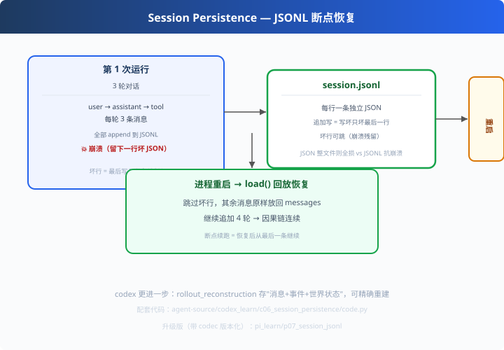

# c06: 会话持久化 — 断电也能续上

> 对应原版：`codex-rs/core/session/rollout_reconstruction.rs`（81KB）`thread-store/`
> 上一步：[c05 上下文压缩](../c05_context_compaction/) ｜ 下一步：[c07 多 Agent](../c07_multi_agent/)
> *"恢复 = 把存的每行原样读回 messages。JSONL 是 Agent 会话的天然格式。"*

---

## 问题

Agent 跑 1 小时，突然断电/超时/崩了。一切重来？
生产级 Agent 的答案：**会话是持久化的，恢复 = 回放**。

但"存会话"有个坑：如果存成一个 JSON 文件，**写一半崩溃 = 整个文件损坏**。
怎么存才抗崩溃？

---

## 方案



**JSONL 追加式存储 + 回放恢复**：

```
每轮对话 → append 一行 JSON（user/assistant/tool 消息）
恢复     → load() 逐行读回，坏行跳过
断点续跑 → 恢复后从最后一条继续循环
```

---

## 原理（读 code.py）

### 第 1 步：为什么 JSONL 而不是一个 JSON 文件？

```python
def append(self, msg):
    with open(self.path, "a") as f:          # 追加模式：不重写整个文件
        f.write(json.dumps(msg) + "\n")      # 每行一条，互相独立

def load(self):
    for line in f:
        try: out.append(json.loads(line))
        except json.JSONDecodeError: continue   # 崩溃残留的坏行跳过
```
- **追加写**：写一半崩溃只坏最后一行，前面全好（整文件 JSON 会全损）
- **逐行独立**：坏行可跳，其他消息照样恢复
- **幂等**：重复 load 不影响数据

### 第 2 步：恢复 = 把消息放回 messages

codex 的 rollout_reconstruction 比教学版更进一步：

| | 教学版 | codex 真实版 |
|---|---|---|
| 存什么 | messages（消息） | 消息 + 事件日志 + 世界状态 |
| 恢复精度 | 从最后一条继续 | 精确重演到任意 turn |
| 存储 | 本地文件 | thread-store + 云端 |

---

## 代码走读

- `SessionStore`：append / load / clear（约 30 行，全章核心）
- `simulate_turn()`：模拟一轮对话写入（user+assistant+tool 三行）
- `__main__`：3 轮落盘 → 手写一行坏 JSON（模拟崩溃残留）→ load 恢复 → 继续第 4 轮

调用链：`对话 → append(JSONL) → [崩溃] → load(跳坏行) → 恢复继续`

---

## 试一下

```bash
python agent-source/codex_learn/c06_session_persistence/code.py
# [第 1 次运行] 3 轮对话全部落盘
# [进程重启] 从 JSONL 回放恢复 → 读取 N 条消息（坏行被跳过）
# [恢复后继续] 追加第 4 轮，因果链连续
```

---

## 练习

1. **手动看文件**：运行后打开 session.jsonl，数数每轮几行、坏行长什么样
2. **注入坏行**：往文件中间插一行乱码，load 验证"前后都恢复"
3. **加轮次恢复**：恢复时只取最后 5 个回合（配 s04 的缓冲思想）
4. **换 SQLite**：deepseek 有 session-persistence-sqlite——对比 JSONL 的取舍
5. **加 codec**：升级到 pi_learn p07 的版本化格式（版本号 + 迁移）

---

## 自测问答

**Q：会话存什么粒度合适？**
A：至少 messages（可回放续跑）；升级存事件日志（可回放 UI）；再升级存世界状态快照（可精确恢复工具/沙箱）。粒度越细成本越高。

**Q：并发写会话怎么办？**
A：单写者追加即可；多写者用锁或换 SQLite（文件锁在上层，别在协议层解决）。

**Q：恢复后安全吗？**
A：恢复"信息"≠恢复"信任"。重要操作重新审批（c03）——人能保证的是当前时刻，不是一小时前。

---

## 延伸

- pi_learn p07：JSONL + codec 版本化（读老版本文件也不崩）——本章的升级版
- 参考实现：`matcher-app/mini_agent/memory.py`（MessageBuffer 可与 SessionStore 组合）