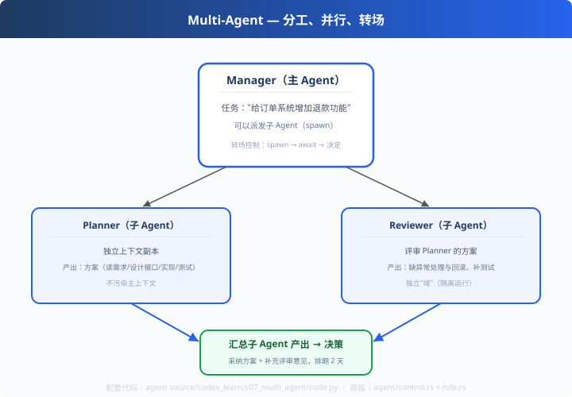

# c07: 多 Agent — 分工、并行、转场

> 对应原版：`codex-rs/core/src/agent/control.rs`（33KB）`agent/role.rs`
> 上一步：[c06 会话持久化](../c06_session_persistence/) ｜ **codex_learn 收官**
> *"一个 Agent 干一行，一群 Agent 干一行——上下文隔离是拆分的支点。"*

---

## 问题

单 Agent 的上下文里：既有代码，又有历史，还有工具结果——全混在一起。
任务复杂时，上下文又乱又贵；角色想换模型/换权限也换不了。

**拆！** 但拆得不好就是"伪多 agent"（共享状态互相污染）。

---

## 方案



**主 Agent + 子 Agent（契约化）**：

```
Manager（主 Agent，掌控全局）
  ├─ spawn ──▶ Planner   （独立上下文副本，产出方案）
  ├─ spawn ──▶ Reviewer  （独立上下文副本，评审方案）
  └─ 回收结果，统一决策
```

---

## 原理（读 code.py）

### 第 1 步：子 Agent = 独立上下文 + 独立能力

```python
class SubAgent:
    def __init__(self, name, system, skill): ...   # 独立的 prompt + 技能
    def run(self, task):
        # 只看到自己的上下文，不知道主 agent 的其它对话
        return self.skill(task)
```
**上下文隔离**是子 Agent 的第一价值：互相不污染，各干各的。

### 第 2 步：转场控制（对应 codex control.rs）

```
spawn（派发任务）→ await（等结果）→ 决定（拿结果继续）→ 可能再 spawn
```
主 Agent 在"转场"时决定谁先谁后、何时回收——流程的"导演"。

### 第 3 步：角色 = 不同的"系统提示词 + 技能"

```python
self.planner  = SubAgent("Planner",  "你负责拆解方案", self._plan_skill)
self.reviewer = SubAgent("Reviewer", "你负责挑毛病",   self._review_skill)
```
教学版用不同函数模拟角色；codex 的 `role.rs` 把角色做成完整配置（工具集/权限/模型都不同）。

---

## 代码走读

- `SubAgent`：独立的 name/system/skill + driver（约 15 行）
- `Manager`：planner/reviewer 装配 + dispatch/parallel_dispatch
- `__main__`：派发 → 平行执行 → 汇总决策（含 driver 标注）

调用链：`Manager 派发 → 子 Agent 独立执行 → Report 回传 → 汇总决策`

---

## 试一下

```bash
python agent-source/codex_learn/c07_multi_agent/code.py
# [Manager] 并行派发 ['analyzer', 'reviewer']（两个独立上下文副本）
#   [analyzer] (in-process) 完成 ...（快）
#   [reviewer] (fork) 完成 ...（独立域）
# [Manager] 汇总：采纳方案并补充评审意见
```

---

## 练习

1. **加第三个角色**：TestWriter，评审通过后出测试计划
2. **换 driver**：把 reviewer 从 fork 换成 in-process，观察隔离语义变化
3. **任务依赖**：reviewer 必须等 planner——做"串行转场"（先 await 再 spawn）
4. **成本分层**：给子 Agent 配不同"价格"，复习 x03 的成本意识
5. **回读源码**：对照 codex 的 `agent/control.rs`，找出"转场"发生在哪个函数

---

## 自测问答

**Q：子 Agent 和主 Agent 共享上下文吗？**
A：不共享！子 Agent 拿的是"任务+相关材料"副本，独立上下文干活，结果交回。主上下文不被中间过程污染，token 也省。

**Q：什么时候该拆子 Agent？**
A：三条件任一：任务可并行（省时）、需要不同角色/模型（省钱省心智）、单上下文太长（省 token）。反之单 Agent 更简单可靠。

**Q：codex 的转场和 claude 的"剧本"区别？**
A：codex 转场是**代码控制**（control.rs 决定谁先谁后）；claude 是**提示词剧本**（md 里写先 haiku 后 sonnet）。代码式更确定，提示词式更省工程——各有适用场景。

---

## 收官：codex_learn 全家福

| c01 Bash | c02 并行 | c03 审批 | c04 沙箱 | c05 压缩 | c06 持久化 | c07 多 Agent |
| --- | --- | --- | --- | --- | --- | --- |
| 万能执行器 | 两阶段并发 | 决策环 | 能力边界 | 沉淀信息 | 抗崩溃存档 | 分工协作 |

- 下一步：[deepseek_learn 状态机](../deepseek_learn/d01_turn_step_loop/)（可插拔架构）
- 总览：[agent-source 索引](../README.md)