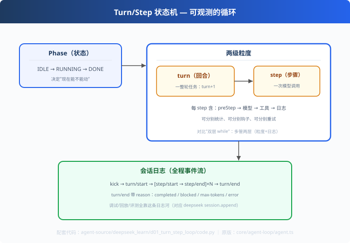

# d01: turn/step 状态机 — 放着比 while 多管两层

> 对应原版：`packages/core/agent-loop/src/agent.ts`（21KB）
> 上一步：无（deepseek_learn 第一课）｜ 下一步：[d02 插件钩子](../d02_plugin_hooks/)
> *"双层 while 管'有没有工具调用'；状态机多管两层——粒度与日志。"*

---

## 问题

learn-mini-agent s01 的循环（双层 while）足够跑通任务，但它的状态只有"进行中/结束"：
- 一次工具调用和整个任务的粒度混在一起，**怎么分别统计、分别干预？**
- 想加安全审查钩子，**往哪挂？**
- 失败发生在哪一步，**日志怎么记？**

两个生产痛点：粒度不可分、过程不可观。

---

## 方案



**turn（回合）/ step（步骤）两级状态机**：

```
IDLE → kick() → RUNNING
   └─ turn()  （一整轮任务）
        └─ step 循环（一次「模型调用 + 工具执行」）
             preStep → 模型 → 工具 → step/end 日志
        turn/end 日志（reason: completed / blocked / max-tokens / error）
→ 回 IDLE，等待下次唤醒
```

---

## 原理（读 code.py）

### 第 1 步：状态与计数分离

```python
self.phase = Phase.IDLE / RUNNING / DONE   # 状态：能不能动
self.turn_no, self.step                    # 计数：第几轮第几步
```
**状态**决定"现在能不能 kick"；**计数**决定"统计到哪了"——职责分开。

### 第 2 步：全程会话日志（面试亮点）

```python
self._log("turn/start", {"turn": 1})
self._log("step/start", {"turn": 1, "step": 1})   # 每次模型调用前
self._log("step/end",   {"turn": 1, "step": 1, "outcome": "completed"})
self._log("turn/end",   {"turn": 1, "reason": "completed"})
```
deepseek 的 `session.append()` 就是把这条**日志河持久化**——调试、回放、评测全靠它。

### 第 3 步：插桩点明确

```python
def _pre_step(self):
    # deepseek 这里不是普通函数，而是 dispatch.waterfall("agent/pre-step", ...)
    return "enter"
```
pre-step 是**每轮模型调用前必经之地**——d02 的插件链就挂在这里。

---

## 代码走读

- `Phase`：idle/running/done 枚举
- `AgentFSM`：`kick()` / `turn()` / `_pre_step()` / `_step()` / `_log()`
- `__main__`：kick 一次 → 打印完整会话日志事件流

调用链：`IDLE → kick → turn+1 → step 循环 → 日志 → IDLE`

---

## 试一下

```bash
python agent-source/deepseek_learn/d01_turn_step_loop/code.py
# 最终状态：idle（turn=1, step=1）
# [kick         ] {'phase': 'running'}
# [turn/start   ] {'turn': 1}
# [agent/pre-step] {'turn': 1, 'step': 1}
# [step/start   ] {'turn': 1, 'step': 1}
```

---

## 练习

1. **改 phase 流**：在 RUNNING 中二次 kick，观察 `RuntimeError` 抛出的防御
2. **加 reason 分支**：`max-tokens` 时保持 DONE 而非回 IDLE（看代码注释逻辑）
3. **接回 while**：外面套 `while fsm.turn(): pass`（真实 driver 写法），改成多回合
4. **日志+回放**：把 self.log 接到 c06 的 SessionStore，实现"持久化状态机"
5. **对比三循环**：pi 双层 while / deepseek 状态机 / codex 事件泵——一分钟各讲一句

---

## 自测问答

**Q：状态机和"双层 while"差在哪？**
A：while 只关心"还有没有工具调用"；状态机额外提供 turn/step 两级粒度 + 全程日志 + 明确钩子点。代价是更绕——pi 用 while（简单），deepseek 用状态机（可插拔）。

**Q：turn/end 的 reason 有什么用？**
A：决定下一步：completed→等新任务；blocked→读 Inbox 新消息（d03）；error→上报/重试；max-tokens→保留状态强制收尾。**失败处理也可观测**。

**Q：什么时候该上状态机？**
A：要插钩子、要恢复、要多 agent 协作时。单 agent 教学用 while 够。

---

## 延伸

- d02：钩子挂哪？就挂在 pre-step 这唯一的必经点
- d03：turn 结束读 Inbox 决定"阻塞/唤醒"——和状态机是一对