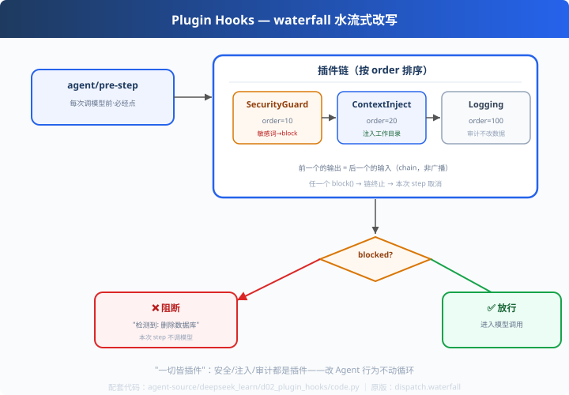

# d02: 插件钩子 — 改 Agent 行为 = 加插件，不动循环

> 对应原版：`packages/core/agent-loop`（preStep 里的 dispatch.waterfall）+ `extensions/*`
> 上一步：[d01 状态机](../d01_turn_step_loop/) ｜ 下一步：[d03 Inbox](../d03_inbox/)
> *"循环是主动脉；给主动脉打补丁不如做插槽。"*

---

## 问题

给 Agent 加"安全审查"或"上下文注入"，最蠢的办法是改循环代码：
循环是主动脉，动一次做一次回归。而且不同场景要不同策略（审查/注入/审计），
**永远改不完**。

---

## 方案



**dispatch.waterfall（水流式插件链）**，挂在 d01 的 pre-step 必经点：

```
agent/pre-step：
  插件A(安全审查, order=10) → 插件B(上下文注入, order=20) → 插件C(审计, order=100)
       └─ 任一个 block() → 链终止 → 本次 step 取消（不发模型请求）
```
**waterfall 语义**：前一个插件的处理结果传给后一个——链式、有序、可阻断。
（对比 parallel：独立并发。代码里 `sort(key=order)` 保证确定性。）

---

## 原理（读 code.py）

### 第 1 步：插件 = 一个方法 + order

```python
class SecurityGuard(Plugin):
    name = "security-guard"
    order = 10                        # 越小越先执行

    def on_pre_step(self, ctx):
        for w in ["删除数据库", "rm -rf"]:
            if w in text:
                ctx.block(f"检测到敏感操作：{w}")
```

### 第 2 步：水流式分发

```python
def waterfall(self, event, ctx):
    for p in sorted(self._plugins, key=lambda p: p.order):
        p.on_pre_step(ctx)
        if ctx.blocked:
            break                     # 任何插件喊停，链终止
```

### 第 3 步：一个钩子点，三种用法

| 插件 | 做什么 | 类型 |
|---|---|---|
| SecurityGuard | 检测敏感词 → block | 拦截 |
| ContextInjector | 追加工作目录信息 | 改写 |
| LoggingPlugin | 打日志不改数据 | 审计 |

---

## 代码走读

- `PluginContext`：消息 + status（blocked/reason）
- `Dispatcher.use()`：注册 + 按 order 排序；`waterfall()`：链式执行 + 阻断
- 三个示例插件：SecurityGuard / ContextInjector / LoggingPlugin
- `__main__`：安全任务放行 vs 危险任务阻断

调用链：`pre-step → plugin(10→20→100) → blocked? → 阻断 or 放行`

---

## 试一下

```bash
python agent-source/deepseek_learn/d02_plugin_hooks/code.py
# [任务] 帮我写个二分查找 → ✅ 放行（消息 +1：注入工作目录）
# [任务] 删除数据库并清空日志 → ❌ 被 检测到敏感操作：删除数据库 阻断
```

---

## 练习

1. **加插件**：RateLimiter（每分钟最多 10 step）——体会"第 100 个插件也就十几行"
2. **plugin 传参**：给插件加 enabled 开关（场景 A/B 测试）
3. **串 hook 事件**：在 tool_result 点挂一个插件（改工具输出格式）
4. **单元测试**：为 waterfall 写"阻断即终止"的断言（复用 s06 思想）
5. **对比 claude hooks**：claude 的 hooks 挂"工具调用"；deepseek 挂"循环 pre-step"——分层差异

---

## 自测问答

**Q："一切皆插件"到底指什么？**
A：循环每个环节（pre-step/tool-call/post-step…）都是钩子点，能力以插件挂载：工具、subagent、webhook、评测都是插件。改需求=换插件，不换代。

**Q：waterfall 和事件总线（pub/sub）区别？**
A：waterfall 有**返回链**——前一个的输出是后一个的输入，还能阻断后继；事件总线是广播（谁订阅谁收到）。deepseek 两种都有：waterfall（决策链）、serial（有序事件）。

**Q：插件顺序怎么保证？**
A：显式 order 字段排序。顺序重要时（先审查后注入）必须可配置——**不能依赖"注册顺序"这种隐式契约**。

---

## 延伸

- d01：钩子点就是状态机 pre-step
- 对比 codex c03 审批：那是内置决策层；deepseek 是任意行为的插槽——分层不同，思想同源