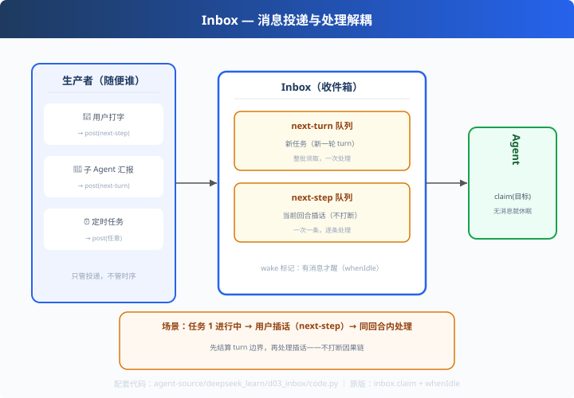

# d03: Inbox — 消息投递与处理解耦

> 对应原版：`packages/core/agent-loop`（inbox.claim / wakeDriver / whenIdle）
> 上一步：[d02 插件钩子](../d02_plugin_hooks/) ｜ 下一步：[d04 严格 schema](../d04_strict_schema/)
> *"谁发消息"和"Agent 什么时候处理"分开——并发友好的第一课。"*

---

## 问题

普通 while 循环的 Agent 是"拉模式"：循环自己主动找消息。但当消息来自
**多方**（用户打字、子 Agent 汇报、定时任务、webhook）：
- 谁负责唤醒它？
- 新任务和"当前任务里插话"是一个粒度吗？
- 没有消息时它该忙等吗？

---

## 方案



**Inbox（收件箱）**：生产者只管 `post()`，Agent 按目标 `claim()`，无消息就休眠。

```
Producer（随便谁）        Inbox                 Agent
  用户   ─post─▶  next-turn 队列 ─claim─▶  处理（新任务）
  子Agent ─post─▶ next-step 队列 ─claim─▶  处理（同回合插话）
  定时器 ─post─▶                  （无消息 when_idle 睡着）
```

---

## 原理（读 code.py）

### 第 1 步：两个队列 = 两种粒度

```python
def post(self, target, msg):
    q = self.next_turn if target == "next-turn" else self.next_step
    q.append(msg); self._woken = True          # 对应 wakeDriver

def claim(self, target, turn):
    if target == "next-turn":
        return list(self.next_turn) 且清空       # 新任务整批处理
    return [popleft()] if next_step else []     # 插话一次一条
```
- `next-turn`：新任务（新一轮 turn，可重置上下文/换模型）
- `next-step`：当前回合内插话（不打断正进行的 turn 边界）

### 第 2 步：唤醒而非轮询

```python
def when_idle(self):
    while self.inbox.has_pending:
        self.work()                       # 有消息才醒，没有就睡
```
生产实现没有忙等：`whenIdle()` 在 `activityDone` 上 await，被 `wakeDriver()` 显式唤醒——
省资源且支持多个 Producer 并发投递。

---

## 代码走读

- `Inbox`：两个 deque + `post/claim/has_pending`（约 30 行，全章核心）
- `Agent`：`when_idle/work` 消费循环
- `__main__`：先投两个 next-turn 任务 → 处理中投 next-step 插话 → when_idle 消化全部

调用链：`post(目标) → 队列 → when_idle 唤醒 → claim → work`

---

## 试一下

```bash
python agent-source/deepseek_learn/d03_inbox/code.py
# [外部] post(next-turn)：调研 MCP 协议...
# [外部] post(next-turn)：写报告...
# [外部] （任务 1 进行中）插话：先总结上次结论
#   [demo] turn 1 开始，领取 2 条任务消息
#   [demo] 同 turn 内插话：先总结上次结论
```

---

## 练习

1. **乱序投递**：先 post next-step 再 post next-turn，验证 claim 优先级（turn 优先）
2. **生产消费平衡**：模拟"投递 50 条、每轮处理 3 条"，观察积压
3. **丢消息保护**：claim 后、work 前进程崩了——配合 c06 持久化恢复
4. **接子 Agent**：d05 的子 Agent 汇报走 next-step，体会 Inturn 协作
5. **对比 pi p02**：pi 是主循环轮询 steering；deepseek 是订阅式 Inbox——两种哲学各讲一句

---

## 自测问答

**Q：Inbox 的价值在哪？**
A：解耦。消息来源不关心 Agent 忙不忙；Agent 处理时不阻塞 Producer。多 Agent 协作、用户插话、调度任务共用一套接入口。

**Q：next-turn 和 next-step 区别的意义？**
A：控制"插话粒度"。next-turn 是新任务（上下文可重置/换模型）；next-step 是当前回合追加（不打断因果链）。一个管"新纪元"，一个管"补充发言"。

**Q：和消息队列（MQ）关系？**
A：同一思想，进程内简化版。跨进程就是 Kafka/RabbitMQ——Inbox 是进程内的队列 + 唤醒机制。

---

## 延伸

- d01：turn 结束读 Inbox 决定"阻塞/继续"——状态机与 Inbox 是一对
- pi_learn p02：steering 的"轮询"式实现，对比阅读