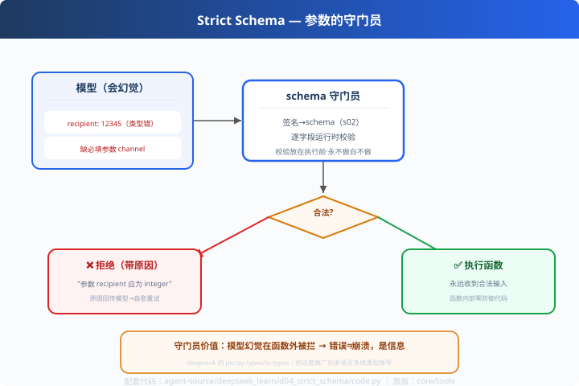

# d04: 严格 Schema — 参数的守门员

> 对应原版：`packages/core/tools/`（schema / json-schema / ptc / py-types / ts-types）
> 上一步：[d03 Inbox](../d03_inbox/) ｜ 下一步：[d05 子 Agent](../d05_subagent/)
> *"schema 不只是给模型看的说明书，还是执行的守门员。"*

---

## 问题

模型生成的工具参数**不一定合法**：`"recipient": 12345`（类型错）、缺字段、
枚举值乱填。如果直接 `func(**args)`：
- 函数内部塞满防御代码
- 非法参数混进状态与日志
- 更糟：错误被发现得晚，追查难

---

## 方案



**schema = 合同 + 守门员**：

```
模型要调 send_notification(channel=email, recipient=12345)
        │
        ▼
   ① schema 校验器 ──✗──▶ 拒绝执行，返回原因（不进函数！）
        │ ✓
        ▼
   ② 执行函数（永远收到合法输入）
```

---

## 原理（读 code.py）

### 第 1 步：签名 → schema（复用 s02）

```python
def strict_schema(name, description, arg_desc=None):
    def deco(func):
        # inspect + type hints 自动生成 schema & 必填列表
        func._schema = {...}
```

### 第 2 步：运行时校验（守门员本体）

```python
def validate(schema, args):
    for req in required:
        if req not in args: return False, f"缺少必填参数 {req!r}"
    for k, v in args.items():
        if t == "integer" and not isinstance(v, int):
            return False, f"参数 {k!r} 应为 integer，收到 {type(v).__name__}"
        if "enum" in p and v not in p["enum"]:
            return False, f"参数 {k!r} 不在枚举 {p['enum']} 内"
        ...
```

### 第 3 步：失败 ≠ 崩溃，回传自愈

```python
def invoke(func, raw_args):
    ok, reason = validate(func._schema, args)
    if not ok:
        return f"拒绝：{reason}（schema 守门员拦截）"   # 模型看到原因可以改
```
和 s09 的错误回传一脉相承——**守门员拦下的不是失败，是信息**。

---

## 代码走读

- `to_schema()`：类型翻译器（可选字段 nullable）
- `strict_schema` 装饰器：签名 → schema 挂到函数上
- `validate()`：逐字段校验（约 25 行，全章核心）
- `invoke()`：守门 → 执行 的外层统一入口
- `__main__`：6 个参数 case 跑全流程（合法×2 vs 类型错/缺字段/枚举错）

调用链：`模型 arguments → validate(schema) → 拒绝(原因) or func(**args)`

---

## 试一下

```bash
python agent-source/deepseek_learn/d04_strict_schema/code.py
# 输入 {"channel":"email","recipient":"a@b.com"}           → 放行
# 输入 {"channel":"email","recipient":12345}               → 拒绝：recipient 应为 integer
# 输入 {"channel":"email"}                                 → 拒绝：缺少必填 channel
# 输入 {"channel":"email","recipient":"a@b.com","tags":"x"} → 拒绝：tags 应为 array
```

---

## 练习

1. **加枚举校验**：给 `priority` 加 `["low","normal","high"]`，跑越界值
2. **嵌套校验**：`list[dict]` 的工具——扩展 validate 递归数组元素
3. **统计拦截**：记录"每次拒绝的原因"，分析模型最常见的幻觉参数类型
4. **连错误回传**：把拒绝原因接进 s09 的循环，演示"模型看到原因自愈重试"
5. **对比 s02**：s02 是"生成 schema"，d04 是"schema 当守门员"——讲清两章分工

---

## 自测问答

**Q：schema 只给模型看吗？**
A：不够。三重身份：① 协议（提示模型怎么传参）；② 守门（校验模型参数）；③ 审计（记录谁传了什么）。deepseek 还把校验做成多语言类型推导（py-types/ts-types）。

**Q：拒绝后模型能自愈吗？**
A：能。原因以 tool 消息回传 → 模型参照修正重试。关键是把原因写得**可执行**（"应为 integer"而不是"参数错误"）。

**Q：校验开销大吗？**
A：内存级比较，相比模型调用可忽略。所以**校验永远放执行前**——不做白不做。

---

## 延伸

- d06：参数守门之外，输出也可能超长——裁剪是输出侧的另一道闸
- 对比 codex c03 审批：schema 管"参数对不对"，审批管"该不该做"——两道不同的闸