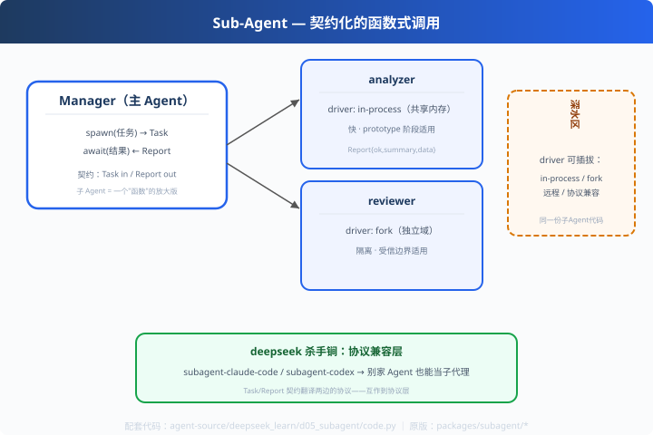

# d05: 子 Agent — 带协议的"函数式调用"

> 对应原版：`packages/subagent/`（11 个子包、114 文件，全仓最大组）
> 上一步：[d04 严格 schema](../d04_strict_schema/) ｜ 下一步：[d06 上下文裁剪](../d06_context_pruner/)
> *"子 Agent = 有参数的函数：Task in / Report out，中间全隔离。"*

---

## 问题

单 Agent 上下文装不下复杂任务（又乱又贵）。拆，但拆得不好就是"伪多 Agent"
（共享状态互相污染）。**真正难的是：怎么让拆出来的部分安全地协作？**

---

## 方案



**契约化的子 Agent**：

```
Manager ──Task(标题/详情/载荷)──▶ SubAgent(独立上下文)
Manager ◀──Report(ok/摘要/数据)──  SubAgent
```
子 Agent = **一个"带参数的函数"**：Task in / Report out。

---

## 原理（读 code.py）

### 第 1 步：Driver 抽象（deepseek 最精巧的组件）

```python
class InProcessDriver:  # 进程内：直接调用，快，共享进程状态
class ForkDriver:       # fork 隔离：独立域，状态隔离
```
**运行方式**是插件式的：in-process（快）/ fork（稳）/ 远程（扩展）。
同一份子 Agent 代码，换 driver 换隔离级别——速度与安全两全的工程答案。

### 第 2 步：契约（Task/Report）

```python
@dataclass
class Task:   title / detail / payload
@dataclass
class Report: ok / summary / data / driver
```
主 Agent 只看 Report 摘要做决策，不等中间过程——**上下文隔离的必然结果**。

### 第 3 步：深水区——协议兼容层（面试谈资天花板）

`subagent-claude-code` / `subagent-codex`：把 Claude Code / codex 的**子代理协议**
翻译成 deepseek 的 Task/Report。效果：**别人家的 Agent 可以当我们的子 Agent，
反之亦然**——多 Agent 互操作做到协议层，这是本系列最惊艳的设计之一。

---

## 代码走读

- `Task / Report`：契约（dataclass）
- `InProcessDriver / ForkDriver`：两种运行方式
- `SubAgent`：name + skill + driver + execute()
- `Manager`：派发/并行、汇总
- `__main__`：analyzer(in-process) + reviewer(fork) 并行 → 汇总 Report

调用链：`Manager dispatch → driver.run(fn, task) → Report → 汇总`

---

## 试一下

```bash
python agent-source/deepseek_learn/d05_subagent/code.py
# [Manager] 并行派发 ['analyzer', 'reviewer']
#   [analyzer] (in-process) 完成 订单系统退款（快）
#   [reviewer] (fork) 完成 ...（独立域）
# [Manager] 汇总报告：...（driver=...）
```

---

## 练习

1. **换 driver**：把两子 agent 都换 fork，观察"隔离"在日志里的差异
2. **任务依赖**：reviewer 需要 analyzer 的 Report——做串行转场
3. **加第三子 agent**：test-writer（进程内），完成"分析→评审→出测试"流水线
4. **协议翻译**：读 `subagent-claude-code` 源码，说说它"翻译"了哪些字段
5. **失败隔离**：让 analyzer 抛异常，验证 fork 模式的崩溃不影响主进程

---

## 自测问答

**Q：什么时候用子 Agent？**
A：三条件任一：可并行（省时）、需不同角色/模型（省钱省心智）、上下文太长（省 token）。反之单 Agent 更简单。

**Q：in-process 和 fork 怎么选？**
A：速度优先 in-process（共享内存零拷贝）；安全优先 fork 或远程（状态独立、崩溃隔离）。生产常按"信任边界"切：内部任务 in-process，外部代码 fork/远程。

**Q：子 Agent 怎么"汇报"？**
A：Report 契约（ok/summary/data）。主 Agent 拿多个 Report 汇总决策，不等中间过程——粒度由你定。

---

## 延伸

- codex c07：codex 的多 Agent 侧重"转场控制"；deepseek 侧重"协议与隔离"——两个都讲才是完整答案
- x03：claude 的"剧本"用提示词编排子 agent——三种多 Agent 组织方式对比