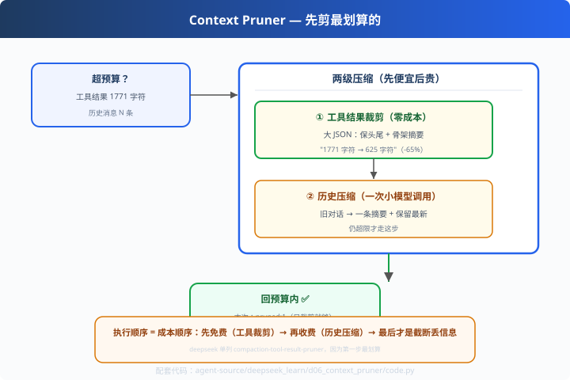

# d06: 上下文裁剪 — 先剪最划算的

> 对应原版：`packages/compaction/*`（compaction-tool-result-pruner 是亮点）
> 上一步：[d05 子 Agent](../d05_subagent/) ｜ 下一步：[d07 提示词组装](../d07_system_prompt/)
> *"先做免费的，再做收费的；裁剪是免费的，压缩是收费的。"*

---

## 问题

上下文膨胀有**三个来源**：消息历史、工具结果、系统提示词。
codex c05 讲"历史压缩"（贵，要调 LLM）；本章讲更划算的第一刀——
**工具结果裁剪**：又长又重复的大 JSON/list 输出，只有骨架对后续有用。

---

## 方案



**两级压缩，先便宜后贵**：

```
超预算？
  ① 裁剪工具结果（pruner）—— 零 LLM 调用，立竿见影
  ② 压缩消息历史（compactor）—— 一次小模型调用，最后手段
  ③ 截断丢消息 —— 尽量避免
```

---

## 原理（读 code.py）

### 第 1 步：结构化裁剪

```python
def prune(self, tool_name, raw):
    shape = self._shape(raw)            # JSON 骨架摘要：{"tasks": list[20]}
    head, tail = raw[:150], raw[-100:]    # 保留头尾
    return head + "…[中间 N 字符已裁剪]…" + tail
```
工具结果的规律：**头是结构（键名）、尾是完整（结尾）、中间全是重复**——剪中间损失最小。

### 第 2 步：结构化摘要（shape）

```python
def _shape(self, raw):
    # {"tasks":[{...item...}...20个]} → {"tasks": list[20]}
```
模型只需知道"有个 20 项的列表"，需要细节时再显式请求完整数据——语义不丢。

### 第 3 步：管线顺序 = 成本顺序

```python
def pipeline(messages, budget):
    if 超限: prune(工具结果)      # 零成本
    if 还超限: compact(历史)      # 一次 LLM 调用
```
**执行顺序就是成本顺序**——这是和"一刀切截断"的本质区别。

---

## 代码走读

- `ToolResultPruner._shape / prune`：结构化裁剪（约 35 行，全章核心）
- `HistoryCompactor.compact()`：历史摘要（保留最新 2 条）
- `pipeline()`：pruner 先行 → 仍超限再压历史
- `__main__`：构造 1771 字符超长工具结果 → 验证 pruned 已达标

调用链：`超限 → prune(工具) → 仍超? → compact(历史) → 回预算`

---

## 试一下

```bash
python agent-source/deepseek_learn/d06_context_pruner/code.py
# 动作：pruned:1 ｜ 用量 691/900
# 裁剪后的工具结果：{"tasks": [{"id": 0, ... …[中间 5571 字符已裁剪]… 
```

---

## 练习

1. **换裁剪策略**：只留 shape（完全丢弃正文），观察模型还能不能回答
2. **加"必要字段"**：某些 key（如 id）永不裁剪——保留结构关键
3. **统计收益**：把每次裁剪的"drop %"打进日志（成本感知）
4. **接工具层**：把 pruner 挂到 s02 registry.call 的出口（自动裁剪）
5. **与 c05 复用**：学完整系列后，把"工具裁剪+历史压缩+窗口截断"三合一

---

## 自测问答

**Q：为什么不一律压缩历史？**
A：贵且慢（每次多一次模型往返）。工具结果裁剪往往已解决 70% 的膨胀（大 JSON 压缩率 80%+）——先做免费的再做收费的。

**Q：剪掉的中间部分模型需要怎么办？**
A：两个出口：① shape 告诉模型"这有 20 项"，需要时显式调工具取完整数据；② 工具结果落地文件 + 按需重读。

**Q：裁剪影响评测吗？**
A：影响——这正是 s06 评测存在的意义：裁剪策略变更后回归跑一遍，确保结论不因裁剪丢失。

---

## 延伸

- codex c05：同样的目标，codex 侧重"历史压缩 + hooks"；deepseek 多一个"工具结果独立裁剪"
- 组合答案：窗口截断（s04）→ 工具裁剪（d06）→ 历史压缩（c05/d06）→ 分支压缩（p06）——完整的四级压缩军火库