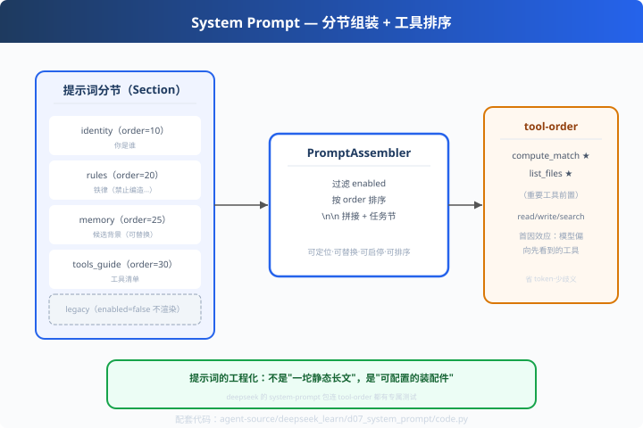

# d07: 系统提示词组装 — 提示词也是工程

> 对应原版：`packages/core/system-prompt/`（index.ts + tool-order.spec.ts）
> 上一步：[d06 上下文裁剪](../d06_context_pruner/) ｜ **deepseek_learn 收官**
> *"胶囊化提示词：每个节可定位、可替换、可启停、可排序。"*

---

## 问题

新手把系统提示词写成 800 字静态字符串：改一句要提心吊胆、加功能要整段重排、
调试时不知道哪句在起作用。**提示词也是要"工程化"的。**

---

## 方案



**分节组装（Section-Based）**：

```python
assembler.add(Section("identity", "你是资深 HR 招聘顾问", order=10))
assembler.add(Section("rules",    "禁止编造分数",       order=20))
assembler.add(Section("memory",   "候选人是张三…",      order=25))
assembler.add(Section("legacy",   "旧功能描述", enabled=False))   # 可禁用
assembler.assemble(task)
```

---

## 原理（读 code.py）

### 第 1 步：Section = 名字 + 内容 + 启用 + 顺序

```python
class Section:
    def __init__(self, name, content, enabled=True, order=100):
```
四个字段对应四个工程诉求：**可定位**（名字）、**可替换**（内容）、
**可启停**（enabled，A/B 测试直接关一节）、**可排序**（order）。

### 第 2 步：组装 = 排序 + 过滤 + 拼接

```python
ordered = sorted((s for s in self.sections if s.enabled),
                 key=lambda s: s.order)
body = "\n\n".join(s.render() for s in ordered)
return f"{body}\n\n## 任务\n{task}"
```

### 第 3 步：tool-order——工具顺序影响选择

```python
def tool_order_strategy(tools, important_first):
    return [t for t in tools if t in important_first] + \
           [t for t in tools if t not in important_first]
```
**首因效应**：模型在选择工具时倾向先看到的；重要工具前置 = 少空转 + 省 token。

---

## 代码走读

- `Section`：四元组（name/content/enabled/order）
- `PromptAssembler`：add/assemble（约 25 行）
- `tool_order_strategy()`：工具排序
- `__main__`：分节组装 + 禁用节演示 + 工具排序对比

调用链：`注册节 → 过滤/排序 → 拼接 + 任务节 → 给模型`

---

## 试一下

```bash
python agent-source/deepseek_learn/d07_system_prompt/code.py
# 组装结果：identity → rules → memory → tools_guide（legacy 被禁用不渲染）
# tool-order：compute_match/list_files 前置
```

---

## 练习

1. **节级 A/B**：把 memory 节 enabled 开关各跑一次评测（s06），看结论差异
2. **动态记忆**：候选人信息由外部注入（替换一节而非整段）
3. **tool-order 实验**：把重要工具排最后，观察模型首轮工具选择
4. **嵌套节**：让一个 Section 由多个子节拼成（递归组装）
5. **只测一节**：为 system-prompt 写单测（deepseek 有 tool-order.spec.ts 参考）

---

## 自测问答

**Q：提示词为什么要"工程化"？**
A：静态长文不可测试（哪句有效说不清）、不可组合（场景多时没法复用）、演进而焦虑。分节后每节可单独评测（A/B）、可替换（换记忆不换人设）。

**Q：记忆放哪一节？**
A：独立 memory 节，紧跟 rules。好处：记忆更新只改一节（换模板）；评测时开/关记忆节即可看效果差异。

**Q：工具排序怎么定？**
A：两步：① 按当前任务 scene 选出候选工具（不是全量）；② 高频/高价值工具前置。deepseek 把①做成动态渲染、②是 tool-order。

---

## 收官：deepseek_learn 全家福

| d01 状态机 | d02 插件钩子 | d03 Inbox | d04 严格schema | d05 子Agent | d06 裁剪 | d07 提示词组装 |
| --- | --- | --- | --- | --- | --- | --- |
| 循环可观测 | 修改不动循环 | 收发解耦 | 参数守门 | 契约化协作 | 先剪免费 | 装配不手糊 |

- 下一步：[pi_learn 事件流](../pi_learn/p01_event_stream/)（现代事件驱动）
- 总览：[agent-source 索引](../README.md)