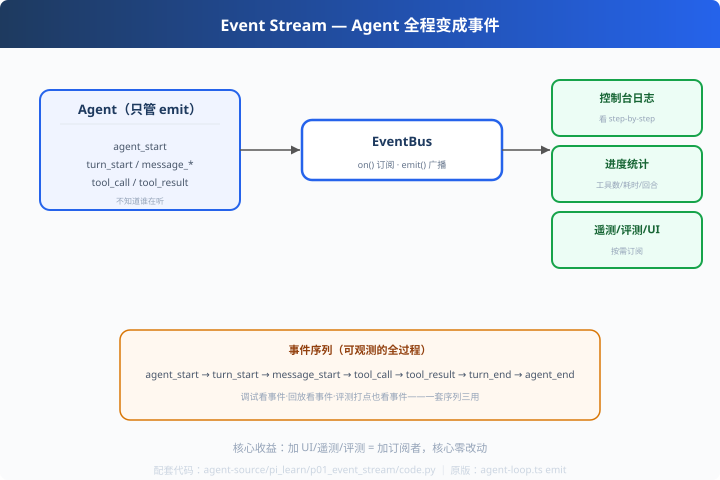

# p01: 事件流 — Agent 的全过程变成事件

> 对应原版：`agent/src/agent-loop.ts`（emit 十几种事件）+ `harness/events.ts`
> 上一步：无（pi_learn 第一课）｜ 下一步：[p02 steering](../p02_steering/)
> *"事件序列 = 执行记录：调试 / 回放 / 评测都用它。"*

---

## 问题

控制台日志、进度条、遥测都在"观察 Agent"，但各写各的 hook：
加一个新 UI 要改 Agent 核心、加一个统计按钮又要改。**核心和观察者沾在一起。**

---

## 方案



**EventBus（发布订阅）**：

```
Agent（emit）→ EventBus → 订阅者们
   agent_start / turn_start / message_start / message_end
   tool_call / tool_result / turn_end / agent_end
   （每个订阅者只关心自己需要的）
```

---

## 原理（读 code.py）

### 第 1 步：EventBus 三行核心

```python
class EventBus:
    def on(self, event, fn): ...      # 订阅
    def emit(self, event, payload):
        for fn in self._subs.get(event, []):
            fn(payload)               # 广播
```

### 第 2 步：订阅者自治

```python
console_logger(bus)      # 订阅者 1：逐步日志
progress_tracker(bus)    # 订阅者 2：工具数/耗时统计
```
Agent 只 `emit`，不知道谁在听；订阅者自己决定关心什么。

### 第 3 步：事件 = 数据源（一套序列三用）

| 用途 | 看什么 |
|---|---|
| 调试 | 事件序列还原执行现场 |
| 回放 | 按事件重演 UI 过程 |
| 评测 | 数工具调用、计耗时（对齐 s06 思路） |

---

## 代码走读

- `EventBus`：on/emit（约 15 行，全章核心）
- `console_logger / progress_tracker`：两种订阅者
- `EventAgent.run()`：全程 emit
- `__main__`：跑一遍，观察 `[log]` 与 `[stats]` 两轨输出

调用链：`Agent.run → emit(事件) → EventBus → 订阅者各自消费`

---

## 试一下

```bash
python agent-source/pi_learn/p01_event_stream/code.py
# [log:agent_start] 开始任务...
# [log:tool_result] ...
# [stats] 工具调用 2 次，累计耗时 0.5s，回合 1 轮
```

---

## 练习

1. **加订阅者**：做一个"进度条"订阅者（收到 tool_result 打印 █）
2. **加新事件**：`error` 事件，Agent 出错时 emit，订阅者报警
3. **事件持久化**：把事件流接到 c06 的 SessionStore（事件日志 = 回放素材）
4. **过滤订阅**：给 on() 加"只订阅 tool_* 前缀"的通配能力
5. **与 p04 呼应**：失败事件（error/aborted）怎么进流——下一站

---

## 自测问答

**Q：事件流 vs 直接函数回调？**
A：事件是"广播"（一个事件多个订阅者，互不干扰）；回调是"直连"（耦合）。多观察者、随时增删的场合事件流更干净。

**Q：事件即数据源？**
A：是。pi 的事件序列可直接用于调试回放、评测打点、成本统计。我们 s06 评测的统计思路同源。

**Q：性能损耗？**
A：进程内广播开销可忽略；跨进程才需要序列化。收益（可观测性）远比代价大。

---

## 延伸

- p03：并行工具的"双轨事件"——事件流的高级用法
- 对比 learn-mini-agent s01 的 print 调试：print 是一次性的，事件是可持续的