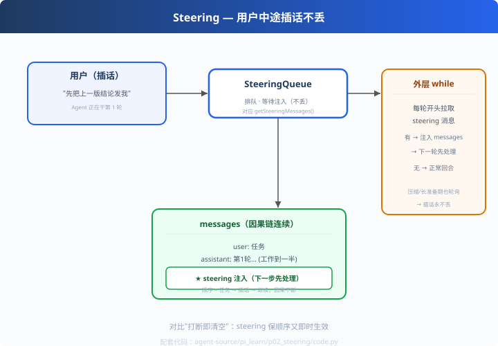

# p02: Steering — 用户中途插话不丢

> 对应原版：`agent-loop.ts` 外层循环 `getSteeringMessages()`
> 上一步：[p01 事件流](../p01_event_stream/) ｜ 下一步：[p03 双轨并行](../p03_parallel_tools/)
> *"不打断因果链，但即时生效——人机协作的顺滑版。"*

---

## 问题

Agent 干活时用户又打了一句："先把上一版结论发我"。
粗暴做法：打断当前回合、清空上下文重来——**浪费 + 断因果**。
pi 的做法：**排队注入**（steering），下一轮先处理插话，再继续主线。

---

## 方案



```
外层 while（持续轮询）
  └─ 每轮开头：pendingMessages = getSteeringMessages()
       ├─ 有插话 → 先注入 messages → 再走正常回合
       └─ 没有 → 正常回合
```

---

## 原理（读 code.py）

### 第 1 步：排队队列

```python
class SteeringQueue:
    def take_all(self):          # 把排队的新消息取走
        ...
```
`take_all` 语义：一次取完、不重复处理。

### 第 2 步：注入消息流

```python
pending = steering.take_all()
for m in pending:
    messages.append(m)           # 插话进入消息流（下一轮模型就能看到）
```
**不打断回合边界、不清理上下文——只是"下一轮先看你说的"。**

### 第 3 步：永不丢失

pi 的细节：压缩/上下文准备可能很长，期间用户输入也会被 `getSteeringMessages`
轮询捞到——**长准备不丢人话**。

---

## 代码走读

- `SteeringQueue`：push / take_all / empty（约 20 行，全章核心）
- `BusyAgent.run()`：外层 while + 每轮拉取 + 注入
- `__main__`：任务进行中（进度 30%）→ 用户插话 → 第 2 轮注入 → 继续

调用链：`用户输入 → 队列 → 每轮开头 take_all → 注入 messages → 继续主线`

---

## 试一下

```bash
python agent-source/pi_learn/p02_steering/code.py
# [agent] 第 1 轮：开发中…进度 30%
# [agent] (steering) 收到并注入：先把上一版结论发给我
# [agent] 第 2 轮：进度 60%（模型已看到插话）
```

---

## 练习

1. **多条插话**：一次 push 3 条，验证顺序注入
2. **插话优先权**：steering 与"新一轮任务"同时存在时谁先（参考 d03 Inbox 的 next-step）
3. **中途压缩**：在"压缩中"发起插话（sec9 的压缩是耗时操作）——验证不丢
4. **与事件流结合**：插话到达时 emit `steering_event`，UI 显示"用户插话"
5. **紧急打断**：给队列加一个 `abort` 通道（do 真正中断），对比 steering 的"排队"

---

## 自测问答

**Q：steering 和实时打断的取舍？**
A：steering 保顺序（下一轮处理），适合"补充性输入"；紧急中断（stop 信号）走 aborted（p04）——pi 两者都有，按紧急程度选。

**Q：会不会插话永远不处理？**
A：外层 while 每轮都拉，压缩/长任务也轮询——不会丢。

**Q：和 deepseek Inbox 的区别？**
A：pi 是"主循环轮询 steering"；deepseek 是"订阅式 Inbox（d03）"。同目标两种实现：轮询简单直观，Inbox 能处理更复杂的唤醒/优先级。

---

## 延伸

- d03：Inbox 的 next-step 队列（插话粒度）——对照理解
- p04：紧急打断（aborted）的"事件化"处理——下一站