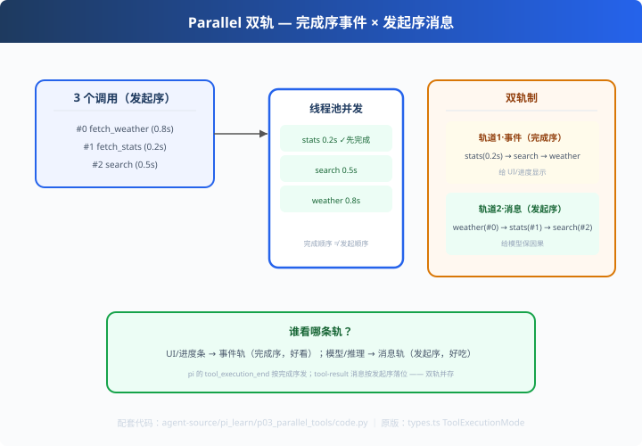

# p03: 并行工具 — 双轨制（完成序事件 × 发起序消息）

> 对应原版：`types.ts` ToolExecutionMode（sequential / parallel）
> 上一步：[p02 steering](../p02_steering/) ｜ 下一步：[p04 失败进流](../p04_failure_in_stream/)
> *"UI 想看谁先完成，模型必须看谁先请求——两条轨各为其主。"*

---

## 问题

并行执行工具时，"谁先完成"（给 UI 展示进度）和"按什么顺序给模型"
（保住因果链）是**两回事**。pi 的处理：**双轨分离**。

---

## 方案



```
execute 并发（线程池）
   ├─ 轨道1（事件）：tool_execution_end 按【完成顺序】发 —— 给 UI/进度
   └─ 轨道2（消息）：tool-result 按【发起顺序】落位 —— 给模型保因果
```

---

## 原理（读 code.py）

### 第 1 步：轨道 1 —— 完成序（观察者视角）

```python
for fut in as_completed(futures):
    self.events.append({"index": idx, "name": r["name"], "finished_at": now})
```
谁先完成谁先进事件列表——进度条就该这么动。

### 第 2 步：轨道 2 —— 发起序（语义视角）

```python
return [json.dumps({"name": calls[i]["name"], ...}) for i in range(len(calls))]
```
消息永远按发起顺序组装——模型看到的因果链不乱。

### 第 3 步：并发安全（写入怎么不乱）

```python
results: dict = {}      # index -> result
for fut in as_completed(futures):
    results[futures[fut]] = ...   # 线程只写自己的槽位
return [results[i] for i in ...]  # 最后一次性按序拼装（无竞态）
```
**并发写槽位 + 串行读组装**——既并发又干净。

---

## 代码走读

- `ParallelRunner.run()`：两阶段 + 双轨（约 25 行，全章核心）
- `self.events`：完成序事件轨
- `__main__`：3 个慢差调用（0.8/0.2/0.5s）→ 双轨输出直观对比

调用链：`3 调用 → 并发执行 → 事件轨(完成序) + 消息轨(发起序)`

---

## 试一下

```bash
python agent-source/pi_learn/p03_parallel_tools/code.py
# 轨道1｜事件流（完成序）：fetch_stats → search → fetch_weather
# 轨道2｜消息流（发起序）：msg@0 天气 / msg@1 stats / msg@2 search
```
肉眼可见：**stats 最先完成，但消息轨里它仍是第 2 条**。

---

## 练习

1. **多轮双轨**：连续两轮并行，验证事件轨全局完成序、消息轨每轮发起序
2. **异常入流**：某工具抛错 → 事件轨发 error、消息轨落 error 文本（不崩整体）
3. **加超时**：超时的调用在事件轨标 `timeout`（对齐 codex 超时闸）
4. **订阅区分**：把事件轨接到 p01 的 EventBus，UI 消费事件轨、模型消费消息轨
5. **对照 codex c02**：codex 只保消息序；pi 多事件轨——各自适合什么 UI

---

## 自测问答

**Q：为什么事件按完成序、消息按发起序？**
A：观察者（UI/进度）看到的是"执行过程"，需要完成序；模型（消费者）看到的是"逻辑结果"，必须是发起序。**观察轨和语义轨独立**——pi/codex 双轨共识。

**Q：并发安全怎么保证？**
A：写入按 index 对齐字典（results[idx]），最后一次性按序拼装——线程只写自己的槽位，无竞态。

**Q：双轨会不会导致"数据不一致"？**
A：不会。两根轨是**同一份结果**的不同视图：事件轨重排序展示，消息轨保序消费——两全其美。

---

## 延伸

- codex c02：消息保序（单轨版）；pi 事件轨是 UI 层的额外收益
- p01：事件轨就是事件流的实战用法