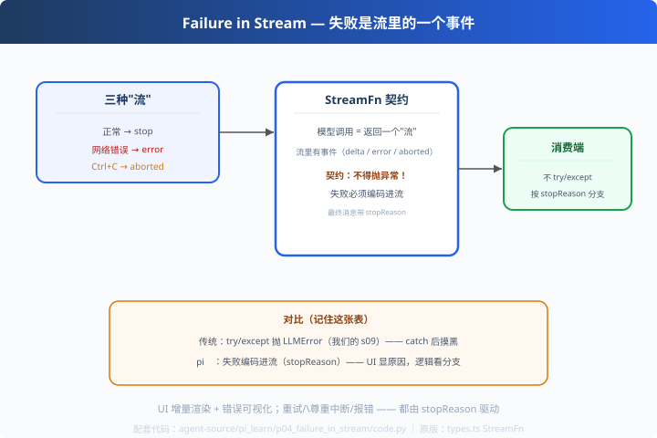

# p04: 失败进流 — 错误是流里的一个事件

> 对应原版：`types.ts` StreamFn 契约（stopReason: "error" | "aborted"）
> 上一步：[p03 双轨并行](../p03_parallel_tools/) ｜ 下一步：[p05 provider 层](../p05_provider_layer/)
> *"失败不是异常，是流里的一个事件——契约说，'不得抛异常'。"*

---

## 问题

模型调用"流式中途断了"（网络/超时/用户 Ctrl+C），怎么办？
传统：`try/except` 抛异常，上层 catch——**UI 看不到中途原因，逻辑分支复杂**。

---

## 方案（StreamFn 契约原文精神）



```
模型每次调用 = 返回一个流（不是只返回最终文本）
  流里有：delta 增量 / error 事件 / aborted 事件
  流结束时给最终消息：stopReason = stop | error | aborted | max_tokens ...
契约：不得抛异常 —— 失败必须编码进流
```

---

## 原理（读 code.py）

### 第 1 步：失败也是流的一部分

```python
def stream_example(kind):
    yield StreamEvent("delta", "正在生成前")
    if kind == "error":                       # 网络挂了：不抛！
        yield StreamEvent("error", "connection reset by peer")
        yield AssistantMessage("", "error", "connection reset...")
    elif kind == "aborted":                   # Ctrl+C：也不抛
        yield StreamEvent("aborted", "user cancelled")
        yield AssistantMessage("", "aborted", "user cancelled")
```

### 第 2 步：消费端只看 stopReason（不 try/except）

```python
def consume(stream):
    for evt in stream:
        if isinstance(evt, AssistantMessage):
            return evt              # 流结束：最终消息（带 stop_reason）
        if evt.kind in ("error", "aborted"):
            print(f"[flow] 收到失败事件：{evt}")
```
上层三种分支：`stop`=完成 / `error`=重试 / `aborted`=尊重中断——**统一按流处理**。

---

## 代码走读

- `StreamEvent`：detai 增量/error/aborted 事件类型
- `AssistantMessage`：content + stopReason + error_message（协议核心）
- `stream_example()`：三种"流"的生成器
- `consume()`：流式消费（isinstance 先行，避免踩 kind 属性）
- `__main__`：三流对比输出（stop / error / aborted）

调用链：`模型调用 → 流事件 → 消费端按 stopReason 分支`

---

## 试一下

```bash
python agent-source/pi_learn/p04_failure_in_stream/code.py
# 正常完成 stopReason=stop      内容='答案是 42'
# 网络错误  stopReason=error    error='connection reset by peer'
# 用户中断  stopReason=aborted  error='user cancelled'
```

---

## 练习

1. **加 max_tokens 分支**：stopReason 第四态（受限收尾但保留状态）
2. **错误重试**：收到 error 事件自动重试（指数退避）+ 流事件记录
3. **UI 展示**：把 error 事件接进 p01 的 EventBus，界面显示错误气泡
4. **对照 s09**：把我们的 try/except 循环改成"失败进流"风格（一次重构练习）
5. **断流恢复**：把"已流出的 delta"缓存，断网恢复后继续生成（续传）

---

## 自测问答

**Q：失败进流 vs 抛异常，什么时候选哪个？**
A：模型调用是"长期运行、部分结果已流出"的操作——异常会丢掉已流出部分；流式事件保留过程。真正"程序错误"（配置错）仍可抛。pi 也是混用：契约只约束"流本身的中断"。

**Q：对上层的好处？**
A：UI 能增量渲染 + 显示错误原因；逻辑层只按 stopReason 分支（重试/尊重中断/报错）统一处理——比"catch 后摸黑"强得多。

**Q：stopReason 有哪几种？**
A：stop（完成）/ error（失败）/ aborted（中断）/ max_tokens（预算耗尽）——**每一种都有对应的处理策略**，这就是"失败是数据流"。

---

## 延伸

- s09：我们的 try/except 兜底 → 学完本步可以升级成"失败进流"
- p05：流式是 provider 层的标准接口（stream 是标配）