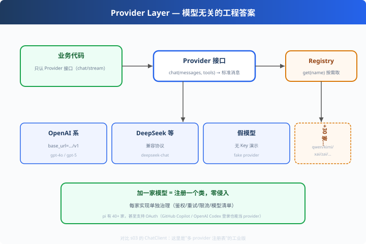

# p05: Provider 层 — 模型无关的工程答案

> 对应原版：`ai/src/providers/`（40+ 家，每厂商一文件 + .models.ts 生成清单）
> 上一步：[p04 失败进流](../p04_failure_in_stream/) ｜ 下一步：[p06 分支压缩](../p06_branch_compaction/)
> *"加一家模型 = 注册一个类；业务代码写完不再改。"*

---

## 问题

业务代码直接调 openai SDK？换 DeepSeek 就得改代码。
**模型无关 = 接口 + 实现 + 配置 三层隔离。**

---

## 方案



```
业务代码 ──▶ Provider 接口（chat/stream）◀─ 实现：
                                      OpenAI / DeepSeek / Fake / Qwen ...
                     ▲
              ProviderRegistry.get(name)  ← .env 里选哪家
```

---

## 原理（读 code.py）

### 第 1 步：接口 + 三家实现

```python
class Provider:
    def chat(self, messages, tools=None): raise NotImplementedError

class OpenAIConvention(Provider):    # 同协议不同端点
    def __init__(self, base_url="https://api.openai.com/v1"): ...
class DeepSeekProvider(Provider):
    def __init__(self, base_url="https://api.deepseek.com/v1"): ...
class FakeProvider(Provider):        # 无 Key 演示
```

### 第 2 步：注册表 + 切换

```python
registry = (ProviderRegistry()
            .register(FakeProvider())
            .register(OpenAIConvention())
            .register(DeepSeekProvider()))
prov = registry.get(choice)          # 运行时切换，代码零改动
```

### 第 3 步：.env 决定用哪家

教学版从根 .env 的 `LLM_BASE_URL` 推断（含 "deepseek" → deepseek，否则 openai）——
**配置外置，切换即配置**。

---

## 代码走读

- `Provider`：接口基类
- `OpenAIConvention / DeepSeekProvider / FakeProvider`：三家实现
- `ProviderRegistry`：register / get（+ 未知厂商明确报错）
- `__main__`：从 .env 解析选型 → 依次切换调用 + 未知厂商报错演示

调用链：`.env → registry.get → Provider.chat → 标准消息`

---

## 试一下

```bash
python agent-source/pi_learn/p05_provider_layer/code.py
# 用 <Provider fake> 调用：...
# 用 <Provider openai> 调用：...
# 用 <Provider deepseek> 调用：...
# 未注册的厂商会被明确拒绝：未知 provider: qwen，可用：[...]
```

---

## 练习

1. **加第 4 家**：QwenProvider（base_url=…aliyuncs.com/compatible-mode/v1）——10 分钟
2. **模型清单**：给 Provider 加 `models()`，属性模型预热切换
3. **自动切换**：get() 失败时回退到 FakeProvider（降级）
4. **流式接口**：把 chat 升级成返回流（对齐 p04 的 StreamFn 契约）
5. **对照 pi 源码**：数 `agent-source/pi/ai/src/providers/` 有多少家 provider 与 .models.ts

---

## 自测问答

**Q：为什么 OpenAI 兼容协议成了事实标准？**
A：DeepSeek/智谱/Moonshot/Qwen 全部兼容 OpenAI 格式——协议统一让"注册新厂商"成本趋近于零。pi 甚至把 GitHub Copilot、OpenAI Codex 的 OAuth 登录也包成 provider。

**Q：provider 层还要管什么？**
A：每家单独的鉴权、重试、限流、模型清单（.models.ts）、OAuth。接口只管 chat，治理各管各的。

**Q：选择策略呢？**
A：注册表只是 get；生产还加 failover（主模型挂了切备用）、按任务选模型（重活贵模型/轻活便宜模型）。

---

## 延伸

- s03：我们的 ChatClient 是"单家适配"；这里升级为"多 provider 注册表"
- p04 + p05：流式失败处理 + provider 层 = 完整模型接入方案