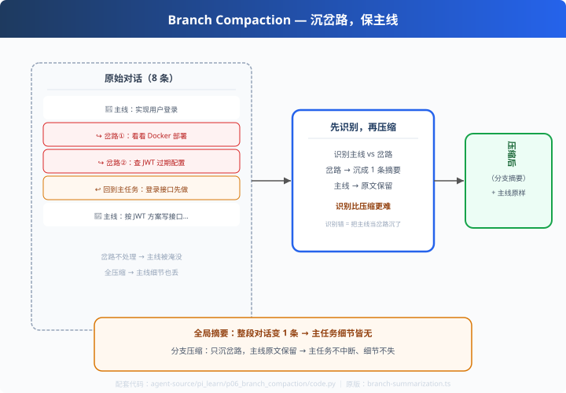

# p06: 分支压缩 — 沉岔路，保主线

> 对应原版：`harness/compaction/branch-summarization.ts`
> 上一步：[p05 provider 层](../p05_provider_layer/) ｜ 下一步：[p07 JSONL 会话](../p07_session_jsonl/)
> *"压缩的重点不在'压'，在'识别'——哪是主线，哪是岔路。"*

---

## 问题

对话里常有"岔路"：用户问登录，中途岔去看 Docker、查 JWT 配置，再回主线。
- 全对话压缩 → **主线细节也丢**（登录方案的具体决定没了）
- 不压缩 → **分支淹没主线**（上下文大部分是岔路）

---

## 方案



**先识别，再压缩**：

```
识别（哪个是主线 / 哪个是分支）
   └─ 分支：压成一条"分支摘要"
   └─ 主线：原文保留
   └─ 分支里的关键决策：可留作"决策记录"
```

---

## 原理（读 code.py）

### 第 1 步：识别岔路（教学版用标记，生产用话题相关性）

```python
def is_branch(msg):
    return "（岔路）" in c or "回到主任务" in c
```

### 第 2 步：分支沉摘要、主线原样

```python
for m in conv:
    if is_branch(m): branch_buf.append(m)          # 进分支缓冲
    elif branch_buf and "回到主任务" in c:
        out.append({"role": "user",
                    "content": "（分支摘要）" + "；".join(branch_buf)[:60]})
        branch_buf = []
    out.append(m)                                  # 主线原样保留
```

### 第 3 步：与全局摘要的本质区别

| | 全局摘要 | 分支压缩 |
|---|---|---|
| 主线细节 | 丢 | 保留（原文） |
| 分支内容 | 一并压 | 沉成一条摘要 |
| 主任务连续性 | 断裂感 | 顺畅 |
| 识别成本 | 无 | **需要识别**（难点） |

---

## 代码走读

- `is_branch()`：岔路识别（教学标记）
- `compress()`：缓冲分支 → 恢复主线时沉摘要（约 20 行，全章核心）
- `__main__`：8 条对话（主线+岔路+回主线）→ 压缩前/后对比

调用链：`遍历 → 识别岔路 → 主线原样 + 岔路摘要 → 紧凑上下文`

---

## 试一下

```bash
python agent-source/pi_learn/p06_branch_compaction/code.py
# 压缩前：
#   [user] 实现用户登录          ← 主线
#   [user] （岔路）看看部署 Docker ← 岔路
#   [user] 回到主任务：登录接口先做 ← 主线恢复
# 压缩后：
#   [user] （分支摘要）…          ← 一条替代两条岔路
#   [user] 回到主任务：登录接口先做 ← 原样
```

---

## 练习

1. **换识别法**：用"话题关键词相似度"替代标记（实现真正的相关性识别）
2. **决策保留**：岔路里的关键决定单独留一条"decision 消息"（不丢决策）
3. **多岔路**：构造 3 条连续岔路再回主线，观察摘要合并
4. **接 p07**：压缩后的消息存入 JSONL 会话（压缩+持久化合体）
5. **对齐 d06/c05**：把工具裁剪、历史摘要、分支压缩三级合并成一个 pipeline

---

## 自测问答

**Q：分支 vs 全局压缩的本质区别？**
A：全局压缩"抹平一切"（主线细节也没了）；分支压缩"沉岔路、保主线"——主任务不中断，重要决定还在原文里。**识别比压缩更难**。

**Q：生产怎么识别分支？**
A：相关性打分（和新话题的相似度）、用户显式标记（"回到XX"）、滑动窗口检测话题漂移。pi 的 branch-summarization 是这套思路的浓缩。

**Q：分支摘要压丢了细节怎么办？**
A：两个兜底：关键决策单独保留（decision 记录）；模型需要细节时从会话文件（p07）回溯原文——持久化是压缩的底气。

---

## 延伸

- d06：工具结果裁剪（先剪免费的）
- c05：历史压缩（带 hooks）
- 至此四级军火库齐了：窗口截断(s04) → 工具裁剪(d06) → 分支压缩(p06) → 历史摘要(c05)