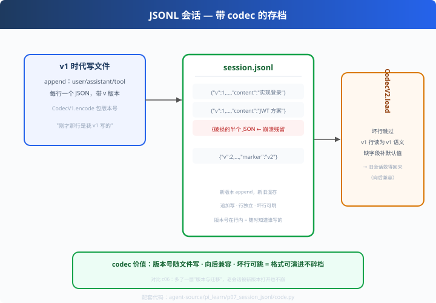

# p07: JSONL 会话 — 带 codec 的存档

> 对应原版：`harness/session/jsonl/`（codec.ts / repo.ts / storage.ts）
> 上一步：[p06 分支压缩](../p06_branch_compaction/) ｜ **pi_learn 收官**
> *"格式会演进：老会话被新版本打开不能崩——这是 codec 存在的理由。"*

---

## 问题

c06 教了 JSONL 存档的基本原则（追加写、坏行跳、恢复回放）。
pi 再进一步：**codec（编解码器）+ 版本控制**。为什么必须？
你的 Agent 1.0 写的会话，2.0 打开了——1.0 的字段 2.0 认不认识？
**版本不兼容 = 老会话全废**。

---

## 方案



```
存储 = JSONL（每行一条）+ Codec（版本化编解码）+ 迁移逻辑
   v1 写文件 ──▶ 升级 v2 后照读（未知字段保留、缺失字段补默认值）
   坏行跳过（崩溃残留不惜）
```

---

## 原理（读 code.py）

### 第 1 步：Codec 版本化

```python
class CodecV1:
    version = 1
    def encode(self, msg): return {"v": 1, **msg}   # 每行带版本号
    def decode(self, row): ...                       # 剥 v 字段

class CodecV2(CodecV1):
    version = 2
    def decode(self, row):
        msg = super().decode(row)
        msg["marker"] = msg.get("marker", f"legacy-from-{msg['source_version']}")
        return msg                                    # 老行补默认值（迁移）
```

### 第 2 步：追加写 + 坏行跳（保住初版原则）

```python
def append(self, msg):
    with self.path.open("a") as f:                    # 追加
        f.write(json.dumps(codec.encode(msg)) + "\n") # 每行独立

def load(self):
    for line in f:
        try: out.append(codec.decode(json.loads(line)))
        except json.JSONDecodeError: continue         # 坏行跳过
```

### 第 3 步：向后兼容的意义

| 场景 | 结果 |
|---|---|
| 1.0 写、1.0 读 | 正常 |
| 1.0 写、2.0 读 | v1 行补默认值，**救得回来** |
| 崩溃残留坏行 | 跳过，其余恢复 |
| 2.0 继续写 | 新旧混存，互不干扰 |

---

## 代码走读

- `CodecV1 / CodecV2`：版本化编解码 + 字段迁移（约 30 行，全章核心）
- `JsonlSession`：append / load（含坏行跳）
- `__main__`：v1 写 → 升级 v2 读（marker 自动补）→ mixed 继续写

调用链：`消息 → codec.encode → JSONL 追加 → crash → codec.decode(跳坏行) → 恢复`

---

## 试一下

```bash
python agent-source/pi_learn/p07_session_jsonl/code.py
# [v1] 老版本写入了 2 条消息
# [v2] 新版本读取：2 条（含 v1 旧行）→ marker 自动补为 legacy-from-1
# [mixed] v2 继续写，新旧混存正常
```

---

## 练习

1. **造 v3**：加第三个字段并让 v2 也能读 v3、v3 也能读 v2（双向兼容）
2. **schema 测试**：写一条"老样本必须能读"的回归测试（对齐 s06 思想）
3. **校验和**：每行加 hash 字段，load 时校验=防静默损坏
4. **接 recovery**：load 后把消息接回 s09 的循环，实现"崩溃续跑"
5. **对比 SQLite**：read 采访场景并发——JSONL 与 SQLite 各自的适用

---

## 自测问答

**Q：JSONL 和 SQLite 怎么选？**
A：JSONL：零依赖、可读、追加写崩溃安全——适合本地会话；SQLite：查询/并发强——deepseek 有 session-persistence-sqlite。按规模升级，接口保持异步友好。

**Q：codec 迁移什么时候触发？**
A：读行时按 v 字段分派 decoder；未来加字段只影响新行，老行走兼容分支。配一个"老样本必须能读"的测试就是闭环。

**Q：会话恢复后安全吗？**
A：恢复信息 ≠ 恢复信任。重启后危险操作重新审批（codex c03）——安全边界按会话重建。

---

## 收官：pi_learn 全家福

| p01 事件流 | p02 steering | p03 双轨 | p04 失败进流 | p05 provider | p06 分支压缩 | p07 JSONL |
| --- | --- | --- | --- | --- | --- | --- |
| 全程可观测 | 插话不丢 | 并发不乱 | 失败是事件 | 模型无关 | 沉岔路保主线 | 断档救得回 |

- 下一步：[claude_learn 插件生态](../claude_learn/x01_plugin_manifest/)
- 总览：[agent-source 索引](../README.md)