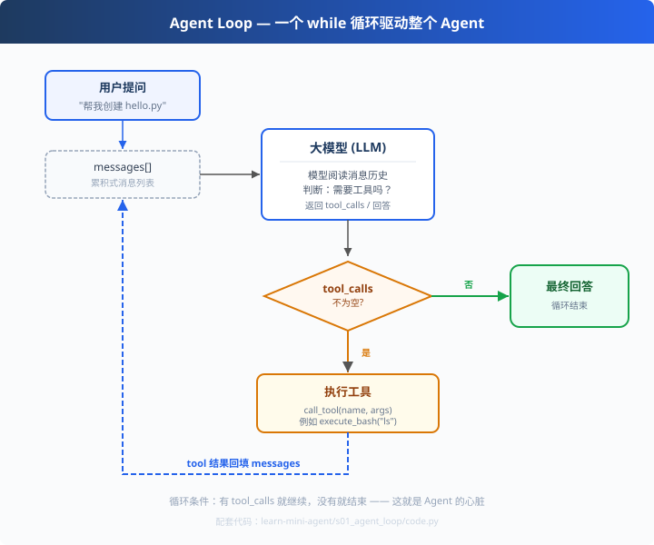

# s01: Agent Loop — 一个循环就够了

`s01` → [s02 工具注册](../s02_tool_registry/) → s03 → s04 → … → s10
> *"One loop & Bash is all you need"* — 一个工具 + 一个循环 = 一个 Agent。
>
> **Harness 层**：循环 — 模型与真实世界的第一道连接。

---

## 问题

你向大模型提问："帮我算一下 2+3，然后把结果写进 result.txt"。

模型能输出它想做的事（比如调用 `add(2,3)`、`write_file`），但**输出完就停了**——
它不会自己执行这些工具，也看不到执行结果，更不会"看到结果后继续推理"。

于是你只能手动替它做中间人：把 `add(2,3)` 抄到 Python 里跑一遍，把 `5` 粘回对话框；
模型看到 `5` 后再说要写文件，你再去执行……每一个来回，你都在做"中间层"。

**把这个中间层自动化，就是本章要做的事。**

---

## 解决方案



一个 `while` 循环：模型要调用工具就继续，不调用就停。整个过程只有两个信号：

| 信号 | 含义 | 循环动作 |
|------|------|---------|
| 响应里**有** `tool_calls` | 模型举手说"我要用工具" | 执行 → 结果回填 → 继续循环 |
| 响应里**没有** `tool_calls` | 模型说"我做完了" | 退出循环，返回最终回答 |

**核心思想**：把工具执行结果"重新喂回"模型，直到模型自己决定不再调用工具。
这一章先不接真实模型——用一个"脚本化演示模型"看清循环骨架；
s02 加工具注册，s03 才接真实大模型（DeepSeek / OpenAI / 任意兼容服务）。

---

## 工作原理

把上面的图翻译成代码，分五步看：

**第 1 步：把用户提问作为第一条消息**

```python
messages = [{"role": "user", "content": query}]
```
`messages` 是**累积式消息列表**——后面每一轮的输入都追加它，模型靠完整的历史推理。

**第 2 步：给模型看"工具说明书"**

```python
TOOLS = [{
    "type": "function",
    "function": {
        "name": "add",                    # 工具名
        "description": "两个整数相加",      # 给模型看的用途
        "parameters": {                   # JSON Schema：告诉模型怎么传参
            "type": "object",
            "properties": {"a": {"type": "integer"}, "b": {"type": "integer"}},
            "required": ["a", "b"],
        },
    },
}]
```
模型不执行代码，它只是"读说明书然后说出意图"——这个 JSON 就是 Function Calling 协议的载体。

**第 3 步：主循环（本章心脏）**

```python
for step in range(1, max_iters + 1):      # ④ 安全上限：防死循环烧钱
    resp = llm.chat(messages, tools=TOOLS)  # ① 发消息+工具定义给模型
    messages.append(resp)                   # ② 模型回复加入历史
    if not resp.get("tool_calls"):          # ③ 模型说"做完了"
        return resp["content"]              #    → 输出最终回答，结束
    for tc in resp["tool_calls"]:           # ⑤ 逐个执行请求的工具
        result = call_tool(tc["function"]["name"],
                           tc["function"]["arguments"])
        messages.append({"role": "tool", "tool_call_id": tc["id"],
                         "content": result})# ⑥ 结果回填 → 回到 ①
```

**第 4 步：工具执行（给世界看的）**

```python
def call_tool(name, arguments):
    args = json.loads(arguments)        # 模型给的是 JSON 字符串
    if name == "add":
        return str(add(args["a"], args["b"]))
```
模型的"意图"和真实世界的"动作"在这里交汇；执行结果转成字符串回填给模型。

**第 5 步：终止条件与防护**

```python
max_iters = 20   # 模型陷入死循环/反复调用时兜底
```
生产环境这是标配：**Agent 循环没有上限 = 无限烧 token**。

---

## 代码走读（code.py）

- `load_env()`：迷你 .env 加载器（演示模式无需任何环境变量）
- `JOSS_TOOLS` 之上的 `TOOLS`：工具说明书（协议载体）
- `FakeLLM`：脚本化演示模型——第一轮请求调用 `add`，第二轮给最终回答，让你**无需 Key 就看清循环行为**
- `run_agent()`：第 3 步的主循环（约 30 行，本章的全部）
- `__main__`：有 Key 走真实模型（`LLM_API_KEY`），否则演示模式

调用链一句话：`用户提问 → run_agent → [LLM ⇄ 工具执行] 循环 → 最终回答`

---

## 试一下

```bash
# ① 演示模式（无需 Key，推荐先跑）
python learn-mini-agent/s01_agent_loop/code.py

# 预期输出：
#   [agent] 第 1 轮：调用工具 add({"a": 2, "b": 3})
#   [agent] 第 1 轮：add 返回 5
#   [agent] 第 2 轮：无工具调用，循环结束

# ② 真实大模型（复制仓库根 .env.example 为 .env 填入 Key）
python learn-mini-agent/s01_agent_loop/code.py
```

---

## 练习

1. **加一个工具**：把 `multiply(a, b)` 加进 TOOLS 和 call_tool，让 FakeLLM 第二轮调用它
2. **观察累积**：打印每轮之后 `messages` 的数量与角色分布，理解"因果链"在累积
3. **触发上限**：把 `max_iters` 改成 1，看第④道防线如何生效
4. **改脚本模型**：给 FakeLLM 加"第三轮才收尾"的剧本，模拟多轮工具调用
5. **对比真实模型**：配 Key 运行，观察"模型自己决定调不调工具"与演示模型的差异

---

## 自测问答

**Q：Agent 和普通 LLM 调用有什么区别？**
A：LLM 调用是"一次性问答"；Agent 是"执行回路"——模型可以请求执行工具、拿到结果继续推理，直到自己给出最终答案。区别的本质是**循环**。

**Q：tool_calls 是什么？**
A：模型响应里的结构化字段，声明"我想调用哪个函数、参数是什么"。参数以 JSON 字符串给出，由宿主（我们）解析执行——模型不执行，执行权在代码。

**Q：为什么工具结果必须回填？**
A：模型是无状态的，每步决策只依赖 messages。不给它看工具结果，它就无法基于真实世界继续推理（比如看到 exit_code≠0 才有机会自我纠错）。

**Q：会不会死循环？**
A：会。所以有三道闸：无 tool_calls 即停（主条件）、`max_iters` 上限（防烧钱）、s09 还会加"连续同类调用检测"。生产再多一道 token 预算。

---

## 接下来

- [s02 工具注册](../s02_tool_registry/)：工具说明书不再手写——函数签名自动生成 Schema
- s09 错误恢复：工具调用失败时，错误如何变成"数据"回传模型自愈
- 参考实现：`earendil-works/pi` 的 `agent-loop.ts`（同样的循环，加了事件流与 steering）