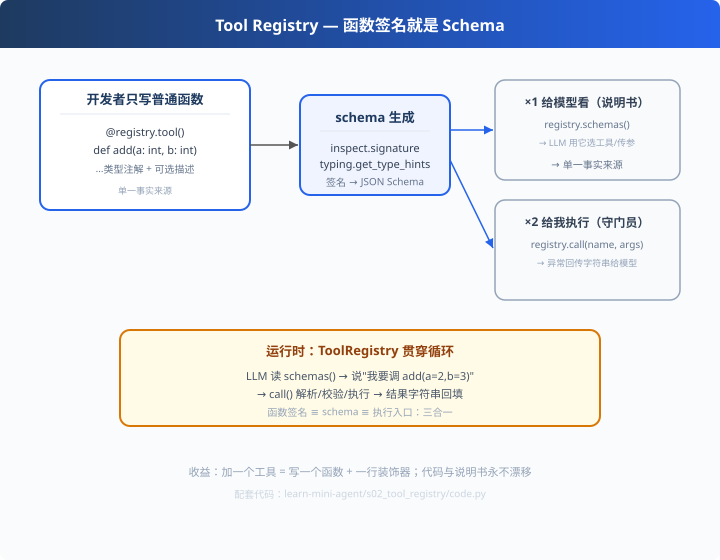

# s02: Tool Registry — 函数签名就是 Schema

`s01` → [s01 Agent Loop](../s01_agent_loop/) → [s03 LLM 客户端](../s03_llm_client/)
> **Harness 层**：工具注册 — Agent 能力的第一入口，账和物合一。
> *"函数签名即 Schema" — 说明书自动生成，永不手写。*

---

## 问题

s01 里给模型看的工具说明书是**手写 JSON**：

```python
TOOLS = [{
    "type": "function",
    "function": {
        "name": "add", "description": "两个整数相加",
        "parameters": {"type": "object",
                       "properties": {"a": {"type": "integer"}, "b": {"type": "integer"}},
                       "required": ["a", "b"]},
    },
}]
```

工具少还行，多了之后三个痛点接踵而至：
1. **漂移**：代码改了签名（`add(a, b, c=None)`），说明书忘改 → 模型按旧 Schema 传参 → 执行报错
2. **易漏**：手写常漏 `required`、把类型写错（`integer` 写成 `int`）——模型拿错说明书，错在源头
3. **心累**：加一个工具 = 复制粘贴一大段 JSON，改一处全盘重排

如果说明书能**从代码自动生成**，以上全部消失。

---

## 解决方案



**让函数签名自己长成 Schema**。借助两个标准库反射：

| 标准库 | 告诉我们的 |
|---|---|
| `inspect.signature(func)` | 参数名、默认值、是否必填 |
| `typing.get_type_hints(func)` | 真实类型注解（含字符串注解解析） |

```python
@registry.tool(arg_desc={"a": "第一个整数"})
def add(a: int, b: int) -> int:
    """两个整数相加"""
    return a + b
```
自动产出：
```json
{"type":"function","function":{"name":"add","description":"两个整数相加",
 "parameters":{"type":"object","properties":{"a":{"type":"integer"}},
 "required":["a"]}}}
```

**一份签名，两个出口**：`schemas()` 给模型看（选工具/传参），`call()` 给我执行（校验/运行/回传）。

---

## 工作原理

### 第 1 步：类型 → JSON Schema（递归翻译）

```python
_SCALAR = {str: "string", int: "integer", float: "number", bool: "boolean"}

def _to_schema_type(t):
    if origin is typing.Union:        # Optional[int] → 可空字段
        ...
    if t is list or origin is list:   # list[str] → {"type":"array","items":...}
        return {"type": "array", "items": ...}
    if t in _SCALAR:                  # int → "integer"
        return {"type": _SCALAR[t]}
    return {"type": "string"}         # 未知类型兜底，宁可宽松
```

### 第 2 步：必填 vs 可选

```python
if p.default is not inspect.Parameter.empty:
    # 有默认值的参数 → 不进 required，附带 default 提示模型
else:
    required.append(pname)            # 无默认值 → 必填
```

### 第 3 步：⚠️ 一个经典坑（值得记笔记）

```python
# 文件顶部若有：from __future__ import annotations
# 注解会变成字符串 'int' 而非类型 int！
# inspect.signature 默认不解析 → 必须用 get_type_hints 取真实类型：
anno = hints.get(pname, p.annotation)
```
我们开发时**真踩过**：单测抓出 `year: int` 被生成为 `"string"`——调试半天原来是注解字符串化。写测试的价值就在这（s06 会展开）。

### 第 4 步：执行与异常兜底（给世界看的）

```python
def call(self, name, arguments):
    args = json.loads(arguments)                 # 模型给的参数是 JSON 字符串
    if not isinstance(args, dict):
        return "错误：参数必须是 JSON 对象 ..."    # 不抛异常，回传字符串
    ...
    except TypeError as e:
        return f"工具调用参数错误：{e}。请参考 schema 修正后重试。"
```
**原则：工具错误 = 以数据回传模型让它自愈，而不是抛异常炸掉整个循环**（s09 深化）。

---

## 代码走读（code.py）

- `_to_schema_type()`：类型翻译器（约 20 行，全章核心）
- `Tool.__init__ / _build_schema()`：函数 → `{name, description, parameters}` 三件套
- `ToolRegistry.tool()`：装饰器注册；`schemas()` → 给模型；`call()` → 执行
- `DemoLLM`：演示模型"读 schema 选工具"，无 Key 可跑
- `__main__`：打印自动生成的两个 schema + 运行循环 + 参数错误兜底演示

调用链：`@registry.tool → 签名反射 → schemas() 给模型 / call() 执行`

---

## 试一下

```bash
python learn-mini-agent/s02_tool_registry/code.py
# 输出：
#   {自动生成的 add/multiply 两份 schema}
#   [agent] 第 1 轮：调用 add({"a": 10, "b": 5}) → 返回 15
#   [agent] 演示参数错误兜底：add() missing 1 required positional argument...
```

---

## 练习

1. **可选参数**：给 `multiply` 加 `round_result: bool = False`，观察 schema 里"非必填+default"的变化
2. **容器类型**：写一个返回 `list[str]` 的工具，确认生成 `"type":"array"`
3. **docstring 即描述**：把 `arg_desc` 删掉，发现 description 自动来自函数 docstring
4. **写单测**：按照"注解坑"的例子，给 `_build_schema` 写 2 条断言（在 s06 会用法）
5. **对比参考**：读 pi 的 `packages/agent/src/harness/tools/`，看它怎么用 typebox 校验 schema

---

## 自测问答

**Q：Function Calling 协议到底长什么样？**
A：请求侧 `tools: [{type:"function", function:{name, description, parameters(JSON Schema)}}]`；响应侧 `tool_calls: [{id, function:{name, arguments(string)}}]`。参数是**字符串**，由宿主 `json.loads` 后执行。

**Q：为什么用函数签名生成 Schema 而不是手写？**
A：三个理由：单一事实来源（代码改了说明书自动变）、新增成本趋近于零（一行装饰器）、类型错误在开发期暴露而非运行期。

**Q：工具参数会出什么问题？**
A：三种典型：非法 JSON、类型不匹配、缺必填字段。工程上统一兜底：捕获 TypeError/Exception → 返回错误字符串 → 模型自愈重试（s09 的"四道防线"之一）。

**Q：注册表为什么既要 schemas() 又要 call()？**
A：目标不同。`schemas()` 服务**模型**（决策需要说明书）；`call()` 服务**世界**（执行需要能力）。一份注册表两个出口，避免"模型手上的说明和真实能力不一致"。

---

## 接下来

- [s03 LLM 客户端](../s03_llm_client/)：s01 的演示模型换成真实大模型，统一 ChatClient
- s09 错误恢复：参数兜底的深化（真实 Bug：模型把 arguments 传成字符串）
- 参考实现：`openai/codex` 的 `tools/registry.rs`（31KB，同思想的 Rust 工业版）