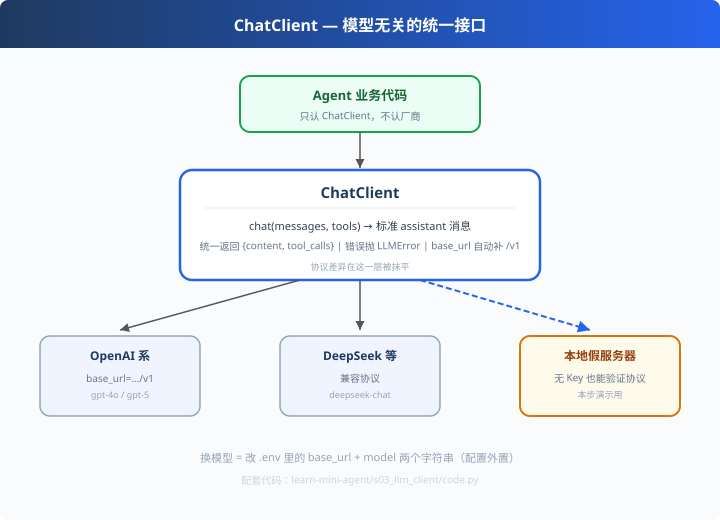

# s03: LLM Client — 模型无关的统一接口

>[s02 工具注册](../s02_tool_registry/) → [s04 上下文管理](../s04_context_memory/)
> **Harness 层**：模型接入层是所有 Agent 的公共地基。
> *"协议统一 + 配置外置" — 换模型只动 .env，代码一行不改。*

---

## 问题

Agent 离不开大模型，但接模型是一件"看起来简单、实际处处是雷"的事：
- OpenAI 自己一套 SDK，DeepSeek 一套，智谱一套，Moonshot 一套……
- 每家 base_url、鉴权头、错误信息格式略有差异
- 今天用 GPT，明天想换 DeepSeek，业务代码散落的 `OpenAI(...)` 调用要改一片

如果 Agent 代码里到处都是厂商 SDK 调用——**换模型就是一场事故**。

---

## 解决方案



**协议统一 + 配置外置**。幸运的是，OpenAI 兼容协议已经成为事实标准
（DeepSeek / 智谱 / Moonshot / 通义 / 千问 全部兼容），所以只需要一个类：

```python
class ChatClient:
    def __init__(self, base_url, api_key, model, ...): ...
    def chat(self, messages, tools=None) -> dict: ...
```

业务代码只面向 `ChatClient.chat()` 这个稳定接口；**所有厂商差异在这一行里被抹平**。
换模型 = 改 `.env` 里两个字符串。

---

## 工作原理

### 第 1 步：自动补 /v1（防御式编程的小例子）

```python
base_url = base_url.rstrip("/")
if not base_url.endswith("/v1"):
    base_url += "/v1"     # OpenAI 兼容服务约定挂 /v1 下
```
用户给 `api.deepseek.com` 就给补全成 `api.deepseek.com/v1`——少一个"怎么传不出问题"的坑。

### 第 2 步：统一出参（Agent 循环唯一依赖的"世界接口"）

```python
def chat(self, messages, tools=None) -> dict:
    ...
    return {
        "role": "assistant",
        "content": msg.content,
        "tool_calls": [{"id", "function": {"name", "arguments"}}] | None,
    }
```
这个返回值和 s01 的循环严丝合缝：有 `tool_calls` 就继续，没有就结束。

### 第 3 步：错误统一

```python
try:
    msg = client.chat.completions.create(**kwargs).choices[0].message
except Exception as e:
    raise LLMError(f"LLM 请求失败（{self.model}）: {e}")
```
上层只 `except LLMError`，不关心是哪家的 500——为 s09 的重试/降级铺路。

### 第 4 步：无 Key 也能验证协议（本步演示核心）

```python
class FakeOpenAITransport:
    """本地简易 /v1/chat/completions 服务器 + transport 注入"""
```
真实 `ChatClient` 发 HTTP 打到**本地假服务器**，你能亲眼看到：
```
[协议观察] 发给服务器的请求体：
  model     : deepseek-chat
  messages  : [{"role": "user", "content": "计算 1+2"}]
  tools     : []
```
等配了 Key，把 transport 换成真实 openai SDK 分支即可——**协议透明、可离线验证**。

---

## 代码走读（code.py）

- `load_env()`：读根 .env（向上回溯查找）
- `LLMError`：统一异常类型
- `ChatClient.__init__`：base_url 归一 + 字段
- `ChatClient.chat()`：transport 注入（演示）or openai SDK（真实）
- `FakeOpenAITransport`：本地假服务器（HTTPHandler 实现 tools 协议手势）
- `__main__`：演示两轮调用 + 打印发出的请求体形状

---

## 试一下

```bash
# ① 演示模式：本地假服务器验证完整协议流程（无需 Key）
python learn-mini-agent/s03_llm_client/code.py
#   [协议观察] 请求体：model / messages / tools

# ② 真实模型：仓库根 .env 配好 Key 后
python learn-mini-agent/s03_llm_client/code.py
#   真实模式：https://…/v1 / {你的model}
```

---

## 练习

1. **换家模型**：改 `.env` 的 `LLM_BASE_URL`/`LLM_MODEL`（如 DeepSeek），跑真实模式零改动
2. **加超时重试**：给 ChatClient 加 `retry(times=3)`（指数退避）——生产必备
3. **transport 可替换**：把 FakeOpenAITransport 换成"记录型"transport，断言请求次数
4. **对比 pi provider 层**：读 `agent-source/pi/ai/src/providers/`，数一数 pi 支持多少家
5. **错误测试**：把 base_url 指向不存在的端口，观察 LLMError 的抛出与信息

---

## 自测问答

**Q：怎么做到的"模型无关"？**
A：三层。① 协议层：OpenAI 兼容格式统一请求/响应；② 客户端层：ChatClient 封装 base_url/api_key/model；③ 配置层：.env 外置。业务代码只见 ChatClient。

**Q：为什么要自动补 /v1？**
A：OpenAI 兼容服务的公共端点约定在 `/v1` 下（如 api.deepseek.com/v1）。用户只给域名时补全，是"防御式编程"——少一种常见的配置错误。

**Q：LLM 调用失败怎么办？**
A：错误统一为 LLMError → 上层可重试（指数退避）→ 可降级（切备用模型/厂商）→ 最终失败保留上下文以便恢复（s09 展开）。

**Q：transport 注入有什么用？**
A：解耦"传输方式"与"业务语义"。测试/演示时注入假 transport，生产切真实 SDK——协议正确性可以离线验证，这是可测试性的关键设计。

---

## 接下来

- [s04 上下文管理](../s04_context_memory/)：解决了"能调模型"，下一个问题是"省着调"——上下文怎么管
- s09 错误恢复：LLMError 的消费端（重试/降级）
- 参考实现：`earendil-works/pi` 的 `packages/ai/`（40+ provider，本步 ChatClient 的工业级放大版）