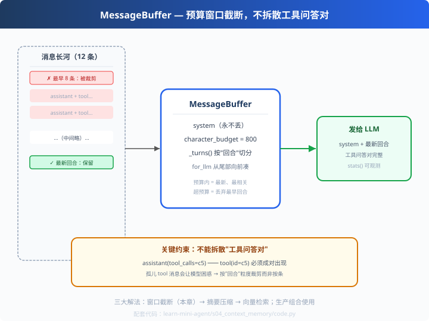

# s04: Context Memory — 预算 + 窗口截断

>[s03 LLM 客户端](../s03_llm_client/) → [s05 匹配应用](../s05_matcher/)
> **Harness 层**：上下文管理 — Agent "活得久"的关键。
> *"三个解法一套用：截断保底、压缩保信息、检索保语义。"*

---

## 问题

Agent 聊得越久，`messages` 越长。模型上下文窗口有上限（常见 128K token），
**塞不下 = 请求报错或被迫丢信息**。这就是"上下文无限膨胀"问题。

我们手写的第一版就是裸的 `messages.append`——简单，但迟早爆。长任务跑一半，
早期的重要约束（用户原话、任务目标）就被挤出了窗口，模型开始"失忆"。

---

## 解决方案



上下文管理三大解法（业界标准答案）：

| 方案 | 做法 | 代价 |
|---|---|---|
| ① 窗口截断（本章） | 超预算就丢最早的**回合** | 简单，但丢信息 |
| ② 摘要压缩 | 旧对话压成一段 summary 塞进 system | 多一次 LLM 调用 |
| ③ 向量检索（RAG） | 只把相关片段塞回上下文 | 需要向量库 |

生产级 Agent 通常是 **1+2+3 组合**：截断保底、压缩保信息、检索保语义。
本章实现①，且有一个被很多人忽略的关键细节——**截断粒度是"回合"，不是"条"**。

---

## 工作原理

### 第 1 步：回合（turn）切割 — 保住工具调用对的完整性

```python
def _turns(self):
    """assistant 消息 + 其后的 tool/user 消息，直到下一条 assistant = 一个回合"""
    turns, cur = [], []
    for m in self.messages:
        if m.get("role") == "assistant" and cur:
            turns.append(cur); cur = []
        cur.append(m)
    ...
```
消息流长这样：
```
user      : 帮我查天气
assistant : tool_calls: get_weather(北京)   ← 发起者
tool      : 25°C 晴                         ← 结果（必须和上面成对）
assistant : 北京今天 25 度
```
如果按"数量"硬切 N 条，可能留下孤零零的 `tool` 消息——模型看到"无源消息"
会困惑甚至幻觉。**按回合切 = 切在整块上，工具对永不拆散。**

### 第 2 步：从尾部向前保留（最新消息最相关）

```python
for turn in reversed(self._turns()):        # 从最新回合往回凑
    cost = sum(_size(m) for m in turn)
    if used + cost > self.char_budget and kept:
        break                                # 预算不够了，但至少保留最新一回合
    kept = turn + kept
    used += cost
```
`system` 永远保留在最前面——**指令不丢**。

### 第 3 步：可观测

```python
stats() -> {"total_msgs": 12, "sent_msgs": 3, "budget_chars": 300, "used_chars": 306}
```
生产环境的 Agent 一定把这类指标打进日志/遥测——**上下文用量是成本与质量的雷达**。

### 应变型：reset()

新一轮任务时清空消息、只留 system（长会话按任务分段）。

---

## 代码走读（code.py）

- `_size()`：JSON 字符数粗估 token 量（中文 1 字符 ≈ 1 token，够用）
- `MessageBuffer`：`add() / reset() / _turns() / for_llm() / stats()`
- `__main__`：灌 12 条消息（6 回合工具对）→ 预算 300 → 观察裁剪；末尾自检"无孤儿 tool"

调用链：`对话增长 → 超预算 → _turns 切块 → 从尾部凑 → system + 最新整回合发给 LLM`

---

## 试一下

```bash
python learn-mini-agent/s04_context_memory/code.py
# [统计] 共 12 条消息，预算 300 字符，实际发送 3 条（用 306 字符）
# system: 你是计算助手...
# assistant tool_calls=c5
# tool        id=c5 content=(60字符)
# [自检] 所有 tool 消息都紧跟其 assistant 发起者：✅ 通过
```

---

## 练习

1. **调预算**：把 `char_budget` 从 300 改成 500/900，观察 sent_msgs 如何增长
2. **实现解法②**：把被裁剪回合交给"小模型"总结成一条塞进 system（借用 s03 的 ChatClient）
3. **统计精度**：中文 1 字符≈1 token 的估算不准在哪？查一下真实 tokenizer 怎么精确计数
4. **压力测试**：写个循环把对话灌到 100 回合，观察 for_llm 的稳定性和 stats
5. **加"关键消息保护"**：给 Buffer 加 `pin(messages)`，让被标记消息永不裁剪（生产的常见需求）

---

## 自测问答

**Q：Context 无限膨胀怎么解决？**
A：三件套：窗口截断（保最近完整回合）、摘要压缩（旧内容沉淀为 summary）、向量检索（按需取回相关片段）。生产组合使用，且全程可观测。

**Q：为什么不能简单地"丢最早 N 条"？**
A：会破坏工具调用问答对（assistant 发起 + tool 回填必须成对），还会丢 system 指令。所以按"回合"为粒度、system 永不丢。

**Q：token 估算怎么做？**
A：演示用字符数近似；生产用各家 SDK 的 tokenizer 精确计数，按预算百分比留余量（要给新回复预留空间）。

**Q：截断和压缩怎么配合？**
A：截断零成本是保底；接近预算或关键轮次时触发压缩（用便宜模型），把被丢内容"提炼"而不是"蒸发"。codex 的 compact.rs 把压缩做成 pre/post hook 流程（c05 教你）。

---

## 接下来

- [s05 匹配应用](../s05_matcher/)：把 s01~s04 拼成第一个真实应用（规则打分器）
- codex_learn c05：压缩生命周期（Pre/Post hooks）+ model fallback
- 参考实现：`openai/codex` 的 `compact.rs` + `compact_model_fallback.rs`