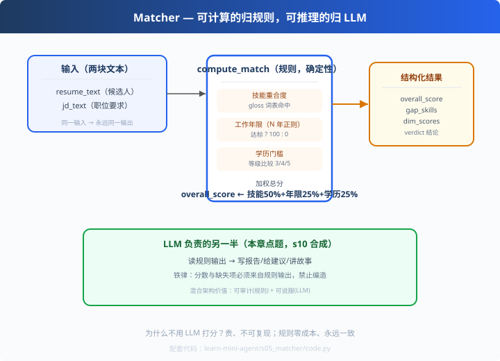

# s05: Matcher — 可计算的归规则，可推理的归 LLM

>[s04 上下文管理](../s04_context_memory/) → [s06 评测集](../s06_evaluation/)
> **应用层**：第一层"真实价值"——把循环、工具、客户端、上下文拼成应用。
> *"规则给锚点，LLM 给表达" — 混合架构是生产级 Agent 的标准姿势。*

---

## 问题

框架再好，也要有"一件事"让它发光。但大多数 Agent 项目的通病是：
**只依赖 LLM 做判断**——又贵又飘（同一输入两次输出可能不同）、无法审计、没法写测试。

比如"计算两个人的相似度"这种可量化判断：
- LLM 打分 → 每次结果漂移、可能编出奇怪理由、烧 token
- **规则算分** → 同一输入永远同一输出，每个分数都有出处

## 解决方案



**把"能确定计算的"交给规则，把"需要推理的"交给 LLM**：

```
规则层（compute_match，确定性）
  技能重合度 / 年限达标 / 学历达标 → 加权总分 + 结论
LLM 层（推理）
  读规则输出 → 写报告、给建议、讲故事（s10 完整闭环）
```

为什么这样分？看个例子：技能覆盖率 86%、缺口是 Elasticsearch——这些是**事实**，
该由代码算出来；而"建议候选人补 ES 还是转岗"是**判断**，该由模型给。

---

## 工作原理

### 第 1 步：技能重合度（词表命中）

```python
SKILLS = ["python", "java", "mysql", "redis", ..., "llm", "rag", "agent", ...]

def _extract_skills(text):
    low = text.lower()
    return {s for s in SKILLS if s in low}

matched = resume_skills & jd_skills
skill_coverage = round(len(matched) / len(jd_skills), 2) if jd_skills else 1.0
```

### 第 2 步：年限与学历

```python
years  = re.findall(r"(\d+)\s*年", text)      # 简历取最大经验，JD 取最低门槛
_EDU_LEVEL = {"博士": 5, "硕士": 4, "本科": 3, "大专": 2}
years_ok = resume_years >= jd_min_years
edu_ok   = resume_edu  >= jd_min_edu
```

### 第 3 步：加权总分

```python
overall = round(skill_coverage * 50 + (100 if years_ok else 0) * 0.25
                + (100 if edu_ok else 0) * 0.25, 1)
verdict  = "强烈推荐" if overall >= 80 else ("推荐" if overall >= 60 else "待定")
```

### 第 4 步：为什么"确定性"是卖点

```python
r1 = compute_match(resume, jd)
r2 = compute_match(resume, jd)
assert r1 == r2      # ✅ 可复现 = 可测试 = 可审计
```
LLM 输出有随机性，规则没有。**把能确定的部分从 LLM 手里拿回来**——既省钱，
又给 LLM 报告提供"锚点"（模型不能瞎编分数，s10 里模型严格遵守）。

---

## 代码走读（code.py）

- `SKILLS` / `_EDU_LEVEL`：两份词表（教学演示用；生产换向量语义匹配）
- `_extract_skills / _extract_years / _edu_level`：三个提取器（纯函数）
- `compute_match()`：全章核心，返回结构化 JSON（skills/coverage/gaps/years/edu/scores/verdict）
- `__main__`：两个 JD 的打分明细 + 可复现性自检（`again == results`）

调用链：`两份文本 → 三项提取 → 加权 → 结构化 JSON（可测试）`

---

## 试一下

```bash
python learn-mini-agent/s05_matcher/code.py
# ▶ backend_engineer  总分：100.0 ｜ 技能覆盖率：100% ｜ 缺口：无
# ▶ ai_engineer       总分：93.0 ｜ 技能覆盖率：86%  ｜ 缺口：elasticsearch
# [可复现性验证] 重复调用同一输入 -> 仍得 93.0 分（✅ 一致）
```

---

## 练习

1. **改权重**：把技能从 50 改到 70，跑 s06 看哪些用例会挂（这正是评测存在的意义）
2. **扩充词表**：加 3 个技能词，重跑两个 JD 的结果变化
3. **边界 case**：让 JD 不提学历，看 `_edu_level(jd_text) or 3` 的默认值逻辑
4. **找语义盲区**："TypeScript" vs "TS" 这种同义词规则识别不了——讨论让 LLM 兜底的方式
5. **写第 6 步的铺垫**：把两个 JD 的期望结论写成注释，下一章直接转成 Oracle 用例

---

## 自测问答

**Q：为什么用规则而不用 LLM 打分？**
A：打分是确定计算——LLM 做又贵又飘（同输入可能不同输出）。规则可审计、可复现、零 token 成本、幻觉为零。**LLM 只做它擅长的：推理与表达。**

**Q：规则会不会漏？**
A：会。词表匹配识别不了语义相近（TS vs TypeScript）。所以是**混合架构**：规则给确定性锚点，模糊地带交给 LLM 在报告里补全——两全其美。

**Q：这个应用你怎么证明它有效？**
A：下一章就是答案——Oracle 用例回归：结论准确率 100%、评分均误差 0.00，可挂 CI。

**Q：权重怎么定？**
A：先按领域经验给初值（技能/年限/学历），再用评测集回归校准——改权重必须重跑评测。这就是"可量化"的红利：改什么都看得见影响。

---

## 接下来

- [s06 评测集](../s06_evaluation/)：把"感觉还行"变成"准确率 100%"
- s10 综合：规则打分 + LLM 写报告的完整闭环（真实模型运行）
- 参考实现：resume-matcher 完整版：`matcher-app/app/tools.py`（同思路的生产版）