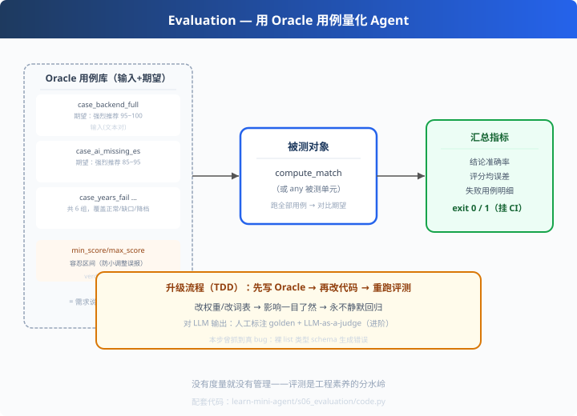

# s06: Evaluation — 用 Oracle 用例量化 Agent

>[s05 匹配应用](../s05_matcher/) → [s07 MCP 协议](../s07_mcp_server/)
> **质量层**：没有度量就没有改进。
> *"评测不是写完再补的，是能力的一部分。"*

---

## 问题

Agent 写完，很快会被问一句："**效果到底怎么样？**"
- 答"我试过几次，感觉还行"——无法说服任何人
- 答"评测集通过率 100%"——一句顶十句
- 更本质：**没有基准，你怎么知道下次改动是变好还是变坏？**

生产里最痛的场景：今天改了个工具 schema，明天线上分数悄悄变差——没人发现。

---

## 解决方案



**评测集（Evaluation Suite）**：一组 (输入, 期望输出) 的配对（Oracle 用例），
跑完自动算指标、给退出码：

```python
CASES = [
    {"name": "case_backend_full",
     "resume": "3 年经验，硕士，Java ...",
     "jd":     "要求 3 年以上，本科及以上，Java ...",
     "verdict": "强烈推荐", "min": 95, "max": 100},   # 期望结论 + 分数容忍区间
    ...
]
```

### 两个核心指标

| 指标 | 含义 | 类型 |
|---|---|---|
| 结论准确率（verdict accuracy） | 判定结论对不对 | 分类指标 |
| 评分均误差（score MAE） | 分数偏差多少 | 回归指标 |

### 退出码 = 可挂 CI

```
全部通过 → exit 0（流水线放行）
有失败    → exit 1（流水线拦截）
```

---

## 工作原理

### 第 1 步：把"期望"显式化

每个用例三件套：输入对（resume/jd 文本）、**verdict**（结论精确相等）、**min/max**（评分容忍区间）。
容忍区间不是偷懒——打分器微调时不该误报，但结论不能变。

### 第 2 步：跑被测对象 + 对比

```python
for c in CASES:
    r = compute_match(c["resume"], c["jd"])
    ok = (c["min"] <= r["overall_score"] <= c["max"]) and (c["verdict"] == r["verdict"])
```

### 第 3 步：汇总 + 退出码

```python
accuracy = passed / total
sys.exit(0 if passed == total else 1)     # 挂 CI 的关键一行
```

### 🎯 真实案例：评测立了功（值得记住）

本系列开发时，单测抓出过这样的 bug：

```python
def f(name: str, years: int, tags: list) -> ...   # tags 期望 {"type":"array"}
# 实际生成 {"type":"string"}  ❌
```
凶手：`裸 list 类型（不带 List[str] 参数）的 typing.get_origin 是 None`，
schema 生成器没识别成数组。**这种 bug 人肉 review 极难发现，一条断言当场抓到。**

---

## 代码走读（code.py）

- `CASES`：6 组 Oracle 用例（正常/技能缺口/学历降档/年限不足/零重合/转岗错配）
- `run_eval()`：遍历→对比→汇总（accuracy + MAE）
- `TestCore`：内嵌两条最小单测（schema 生成、工具异常兜底）——顺带联测 s02
- `__main__`：跑评测 + 单测 + `sys.exit(ok)`，可挂 CI

调用链：`用例库 → compute_match → 对比 oracle → 指标汇总 → 退出码`

---

## 试一下

```bash
python learn-mini-agent/s06_evaluation/code.py
# [PASS] case_backend_full: score=100.0 (期望 95~100) ...
# ========== 评测汇总 ==========
#   结论准确率 : 100% (6/6)    评分均误差 : 0.00 分
#   结果       : ✅ 全部通过（exit=0，可挂 CI）
echo $LASTEXITCODE    # 0
```

---

## 练习

1. **故意弄挂**：把 s05 的权重从 50 改成 70 → 重跑评测，看哪些用例 FAIL（感受"回归拦截"）
2. **加一个用例**：设计第四个满分类 case 加入 CASES，跑通
3. **改 oracle 区间**：把某个 min/max 改窄，观察误报——理解"容忍区间"的意义
4. **TDD 三步走**：先写期望→改代码→重跑，完整走一遍"先写 Oracle 再实现"
5. **进阶题**：LLM 输出的评测怎么做？答案方向：人工标注 golden + LLM-as-a-judge + 相关度

---

## 自测问答

**Q：怎么评测 Agent？**
A：三层：① 确定性组件（打分器/schema）用 Oracle 回归，量化到准确率；② 端到端用冒烟测试（完整链路不崩、产出正确）；③ LLM 文本输出用人工标注 + LLM-as-a-judge 对比。

**Q：评测挂了怎么办？**
A：看失败归属：规则层挂 = 逻辑 bug 或 oracle 过期；LLM 层挂 = 提示词/上下文问题，需人工复核。**先分清是代码错还是期望错**。

**Q：Oracle 用例怎么维护？**
A：它是"需求说明书"的活体版本。加能力 = 先写新 oracle 再改代码（测试驱动），防回归。删用例要谨慎——那是丢弃需求。

**Q：exit code 挂 CI 的意义？**
A：让评测成为**自动流水线的一部分**而不是手工仪式。push 即跑，坏变更进不了主干——`.github/workflows/ci.yml` 已经把这套配好了。

---

## 接下来

- [s07 MCP 协议](../s07_mcp_server/)：评测保障了正确性，下一步打通生态——从零实现 MCP
- matcher-app：完整的 15 单测 + 评测集 + CI（同一套思想的生产版）
- 参考实现：`earendil-works/pi` 自带 `packages/evals/`——大厂也把评测当一等公民