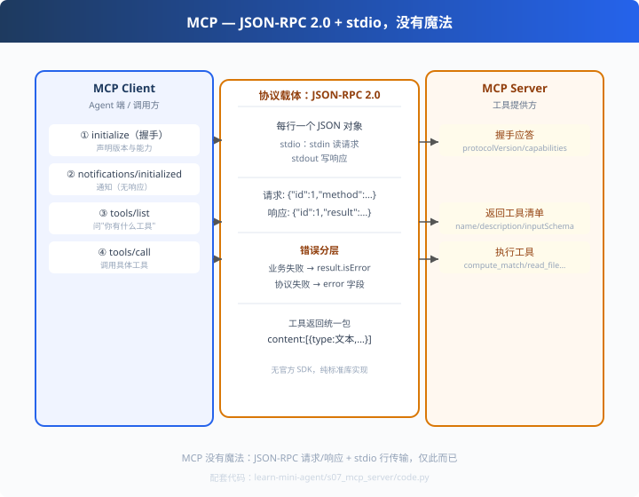

# s07: MCP Server — 从零拆掉协议的黑盒

>[s06 评测集](../s06_evaluation/) → [s08 Agent × MCP](../s08_mcp_agent_bridge/)
> **互操作层**：MCP 是 2025 年 Agent 生态的"USB-C 接口"。
> *"MCP = JSON-RPC 2.0 + stdio。懂了这一点，它就再无秘密。"*

---

## 问题

你的 Agent 内置了 `compute_match`、`read_file`……但**别人用不了你的工具**：
- 每个人都在重复造"自己的工具协议"
- Agent 与 Agent 互不连通，生态碎成孤岛
- 每次接入一个新工具 = 一次私有集成

需要一个**统一接口**，让"工具"和"Agent"解耦——这就是 MCP 诞生的原因。

---

## 解决方案



MCP（Model Context Protocol）被大量文章包装得很吓人，其实只有两句话：

> **MCP = JSON-RPC 2.0（消息格式） + stdio（传输：每行一个 JSON）**

本章用**纯标准库**实现 Server（分发）与 Client（握手调用），没有官方 SDK——
拆掉黑盒，看到本质。

---

## 工作原理

### 第 1 步：生命周期四步（推荐手绘）

```python
client.request("initialize", {...})                # ① 握手：声明版本/能力
client.put_notification("notifications/initialized") # ② 通知初始化完成（无响应）
client.request("tools/list")                        # ③ 问"你有什么工具？"
client.request("tools/call", {"name": ..., "arguments": ...})  # ④ 调用
```
前两步是"手拉手认识"，后两步才是干活。

### 第 2 步：Server 分发（约 30 行核心）

```python
def _dispatch(self, req):
    method = req.get("method")
    if method == "initialize": return ok(握手应答)
    if method == "tools/list":  return ok(工具清单)
    if method == "tools/call":  return self._call(rid, params)
    return err(-32601, f"未知方法: {method}")
```
每条请求按 `method` 路由；stdin 逐行读、stdout 逐行写，就这么朴素。

### 第 3 步：⚠️ 错误分层（细节题）

```python
# 工具不存在 / 方法不存在 → JSON-RPC error 字段（协议层问题）
return self._err(rid, -32601, f"未知方法: {method}")

# 工具执行失败（如参数不全）→ result.isError = true（业务层问题）
return self._ok(rid, {"content": [...], "isError": True})
```
区分两层的意义：**协议层坏了要换客户端/修代码；业务层坏了只需改工具实现**，
调用方甚至不用变。现场演示两条路径的差异输出。

### 第 4 步：工具返回统一包一层

```python
{"content": [{"type": "text", "text": "<JSON 字符串>"}], "isError": false}
```
MCP 规定所有工具返回都包成 `content` 数组——文本、图片、结构化数据统一，
Agent 只需要解析 `text`。

---

## 代码走读（code.py）

- `MCP_TOOLS`：工具注册表（把 s05 的 compute_match 挂进去）
- `MCPToolServer`：`run_stdio()`（逐行循环）+ `_dispatch()`（路由）+ `_call()`（执行+isError）
- `MCPClient`：`request()`（带 id 同步请求）+ `put_notification()`（通知）
- `__main__`：演示完整生命周期 + 未知工具（error）vs 参数不全（isError）对比

调用链：`stdio 行 → dispatch → tools/call → 执行业务工具 → content 回传`

---

## 试一下

```bash
python learn-mini-agent/s07_mcp_server/code.py
# ① initialize -> protocolVersion=2024-11-05, server=mini-mcp-server
# ② tools/list -> 发现 1 个工具: ['compute_match']
# ③ tools/call compute_match -> 总分 91.5（isError=False）
# ④ 未知工具 -> JSON-RPC error（协议错误）
# ⑤ 参数不全 -> result.isError=True（业务错误）   ← 分层对比

python learn-mini-agent/s07_mcp_server/code.py --serve   # 常驻模式，供任意客户端连
```

---

## 练习

1. **加一个工具**：往 `MCP_TOOLS` 注册 `read_file`，重新跑 tools/list
2. **换传输**：把 stdio 换成 HTTP/SSE——体会"传输层可替换"（MCP 的分层设计）
3. **坏行容错**：往 stdin 灌一行非法 JSON，观察 Server 不崩（`json.JSONDecodeError` continue）
4. **对比官方 SDK**：查 `mcp` 官方库的 tools/call 结构，diff 本章实现
5. **画时序图**：手绘四步生命周期（能白板画出来=真的懂了）

---

## 自测问答

**Q：MCP 和 Function Calling 什么关系？**
A：分层关系不冲突。Function Calling 是"模型↔宿主"协议（模型请求调函数）；MCP 是"宿主↔外部工具服务"协议（工具在网络边界复用）。一个 MCP Server 可以被任意客户端接入。

**Q：MCP 有哪些传输？**
A：stdio（本地子进程，本章）、HTTP with SSE（远程）、Streamable HTTP。都跑同样的 JSON-RPC 消息。

**Q：为什么工具结果要 isError 而不是抛异常？**
A：业务失败（参数错、文件不存在）是"预期内的失败"，客户端应能拿到内容展示给 LLM 自愈；协议错误（未知方法）是"不该发生的"，走 JSON-RPC error。**两类错误两种通道**。

**Q：inputSchema 是哪来的？**
A：就是 s02 的函数签名生成器产物！一套签名，OpenAI function calling 和 MCP 两种协议通吃。

---

## 接下来

- [s08 Agent × MCP](../s08_mcp_agent_bridge/)：让我们的 Agent 当客户端，动态外接服务器
- 参考实现：resume-matcher 的 `matcher-app/mini_agent/mcp.py`（本章的完整封装版）