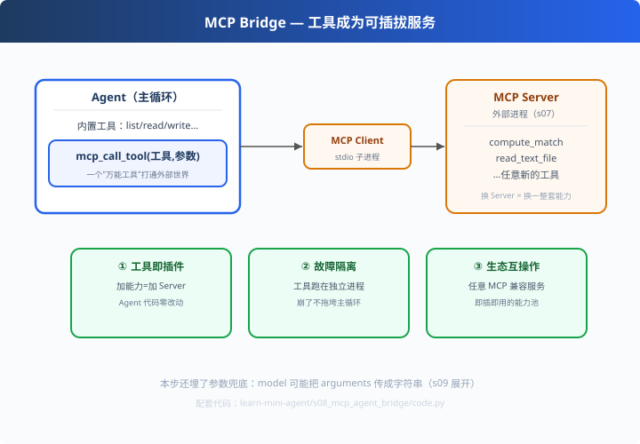

# s08: Agent × MCP — 工具变成可插拔服务

>[s07 MCP Server](../s07_mcp_server/) → [s09 健壮性](../s09_error_recovery/)
> **互操作层**：Agent 从"内置工具"进化到"外接生态"。
> *"工具 = 可插拔服务；换一个 Server，就是换一整套能力。"*

---

## 问题

s07 写了个 MCP Server，但**谁来用它**？如果只有我们自己连，
那和直接写个 Python 函数有什么区别——MCP 的价值还没兑现。

真正的问题是：Agent 的工具要不要**永远内置**？
- 工具越来越多，主进程越来越重
- 别人（Claude Code / Codex / 团队）的好工具，我们接不上
- 危险工具跑在主进程里，崩了全完

---

## 解决方案



**桥接工具**：在 Agent 的工具表里加一个"万能工具" `mcp_call_tool`：

```python
def mcp_call_tool(tool_name: str, arguments: dict = None) -> str:
    """通过 MCP 协议调用外部服务器上的工具"""
    with MCPClient(SERVER_CMD) as client:
        return client.request("tools/call", {
            "name": tool_name, "arguments": arguments})["content"][0]["text"]
```

对 Agent 来说它只是一个普通工具；对世界来说它打开了协议大门：

```
Agent(mcp_call_tool) → MCP Client →stdio→ MCP Server（外部进程）
                                        └─ compute_match / read_file / 任意新的
```

---

## 工作原理

### 第 1 步：桥接工具封装协议

参数是 `(tool_name, arguments)`，内部细节（子进程、握手、content 解包）全部封装。
Agent 的循环不需要知道 MCP 存在——它只是"调用了一个工具"。

### 第 2 步：三个收益（面试必答）

| 收益 | 说明 |
|---|---|
| ① 工具即插件 | 加能力 = 加一个 Server，Agent 代码一行不改 |
| ② 故障隔离 | 外部工具跑在独立子进程，崩了/卡了不拖垮主循环 |
| ③ 生态互操作 | 社区 1000+ MCP Server 即插即用，免费获得整个生态 |

### 第 3 步：⚠️ 参数兜底（为 s09 埋的坑）

```python
if isinstance(arguments, str):
    arguments = json.loads(arguments)   # 模型把 JSON 对象序列化成字符串时兜底
```
真实踩过的坑：模型调用 `mcp_call_tool` 时把 `arguments` 传成了 JSON **字符串**，
服务端 `**args` 当场炸。桥接层做一次类型归一，Agent 就稳了。

---

## 代码走读（code.py）

- `mcp_call_tool()`：桥接实现（with MCPClient + content 解包 + 参数兜底）
- `DemoLLM`：演示模型第一轮就决定"经 MCP 调 compute_match"
- `run_agent()`：复用 s01 的循环骨架，工具换成桥接
- `__main__`：Simulate 完整决策链（Agent 自主选桥接工具 → 外接服务器 → 拿 91.5 分）

调用链：`Agent 决策 → mcp_call_tool → MCPClient → Server.compute_match → content 回传`

---

## 试一下

```bash
python learn-mini-agent/s08_mcp_agent_bridge/code.py
# [agent] 第 1 轮：mcp_call_tool(compute_match)
# [agent] 第 1 轮：MCP 返回 -> 总分 91.5
# [agent] 最终回答：评估完成，结论：强烈推荐
```

---

## 练习

1. **多工具**：往 s07 的 Server 注册 read_text_file，让 Agent 一次走读文件+打分两步
2. **练故障**：故意让 Server 提前退出，观察错误如何被 Agent 消化（不崩）
3. **接社区**：起一个社区 MCP Server（GitHub 工具等），换 SERVER_CMD 即可接入
4. **做权限**：给 mcp_call_tool 加"工具名白名单"，权限最小化（对照 claude x02）
5. **倒因为果**：把 arguments 传成字符串再跑一次，验证 _coerce_args 的兜底生效

---

## 自测问答

**Q：Agent 需要把工具都做进进程里吗？**
A：不一定。高频低延迟的内置（文件读写）；低频或有隔离需求的走 MCP/插件进程。**按热度与风险分层**是生产共识。

**Q：MCP 调用比直接函数调用慢，值吗？**
A：值。多一次 IPC 换来解耦、隔离、复用。stdio 本地进程开销毫秒级，可接受。

**Q：Agent 怎么知道有哪些 MCP 工具？**
A：启动时 `tools/list` 拉一次，把返回的 inputSchema 合并进 Agent 工具表（s02 的 schema 格式可直接复用）。

**Q：兜底为什么不放在最底层？**
A：因为"谁污染谁清理"——桥接层最了解自己的协议细节，把参数归一化收口在一个点，别让错误到处蔓延（s09 展开"失败=数据流"思想）。

---

## 接下来

- [s09 健壮性](../s09_error_recovery/)：参数兜底、错误回传自愈、迭代上限——让这套外接体系站得住
- 参考实现：resume-matcher 的 `matcher-app/app/mcp_tools.py`（含 _coerce_args 生产版）