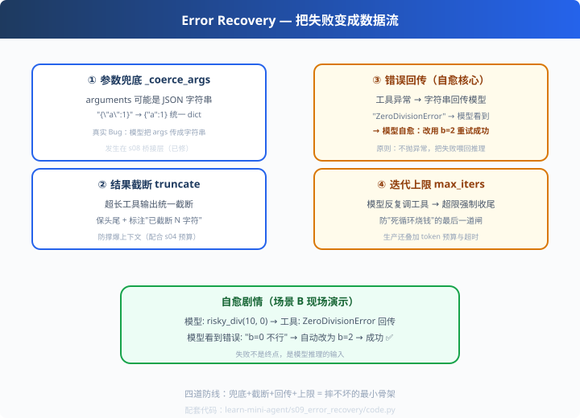

# s09: Error Recovery — 摔不坏的 Agent

>[s08 Agent × MCP](../s08_mcp_agent_bridge/) → [s10 综合](../s10_comprehensive/)
> **健壮性层**：真实世界的 Agent 必须把失败当数据流。
> *"兜底 + 截断 + 回传 + 上限：让 Agent 在真实世界里摔不坏。"*

---

## 问题

教学环境里模型乖巧听话；真实生产里，模型什么都会干：
- 把 `arguments` 传成 JSON **字符串**而不是对象
- 参数类型传错、缺字段、请求不存在的工具
- 工具本身抛异常（除零、文件不存在、网络超时）
- 死循环式地反复调工具——烧你的钱

如果 Agent 在这些情况下一碰就崩、一崩就烧钱——它上不了线。

---

## 解决方案



**四道防线**（每个都是真实踩过的坑）：

| # | 防线 | 一句话 |
|---|---|---|
| ① | 参数兜底 `_coerce_args` | arguments 传成字符串也给它归成 dict |
| ② | 结果截断 `_truncate` | 超长工具输出截断，防撑爆上下文 |
| ③ | 错误回传 | 工具异常变字符串回传 → 模型自愈重试 |
| ④ | 迭代上限 `max_iters` | 防死循环烧钱的最后一道闸 |

---

## 工作原理

### ① 参数兜底：一个真实 Bug

开发时某模型调用 `mcp_call_tool` 传入：
```json
{"tool_name": "compute_match", "arguments": "{\"path\":\"...\"}"}
```
内层 `arguments` 是**字符串**而非对象——服务端 `**args` 当场 TypeError。
桥接层加一行归一，Agent 稳了：

```python
def _coerce_args(arguments):
    if isinstance(arguments, str):
        return json.loads(arguments)      # "{\"a\":1}" -> {"a":1}
    return arguments or {}
```

### ② 结果截断

```python
def _truncate(text):
    return text if len(text) <= MAX else text[:150] + f"...(截断,共{len(text)}字符)"
```
保头尾 + 明确标注"哪段被截了"——模型知道有更多内容没看到。

### ③ 错误回传 = 自愈入口（全章灵魂）

```python
except TypeError as e:
    return f"工具调用参数错误：{e}。请参考工具 schema 修正参数后重试。"
except Exception as e:
    return f"工具执行失败：{type(e).__name__}: {e}"
```
关键是**不抛异常**。错误以字符串回到消息流 → 模型"看到"错误 → 修正 → 重试。
现场演示：模型算 `10/0` 报错后自己改 `b=2` 完成——这是自愈。

### ④ 迭代上限

```python
for step in range(1, max_iters + 1):
    ...
return "(到达迭代上限，强制收尾——防线④生效)"
```
模型永远调工具时，这是最后一道闸。生产上还配 token 预算与超时。

---

## 代码走读（code.py）

- `_coerce_args()` / `_truncate()`：两个工具函数（①②）
- `Executor.call()`：执行器——三层 try/except 全兜成字符串（③）+ 截断（②）+ 兜底（①）
- `NaiveModel`：一个"会犯错"的演示模型（三个场景剧本）
- `run_agent()`：带 max_iters 的循环（④）
- `__main__`：场景 A 兜底 / 场景 B 自愈 / 场景 C 上限

调用链：`模型犯错 → 兜底/截断 → 执行异常转字符串 → 回传 → 模型自愈 → 上限兜底`

---

## 试一下

```bash
python learn-mini-agent/s09_error_recovery/code.py
# 场景A｜参数字符串 -> ① 兜底后一次成功
# 场景B｜ZeroDivisionError -> ③ 错误回传 -> "b=0 不行，改用 b=2" -> 5 ✅
# 场景C｜永远调工具 -> ④ (到达迭代上限，强制收尾)
```

---

## 练习

1. **加超时错误**：让 Executor 抛"网络超时"，看错误字符串怎么回传、模型怎么重试
2. **调小截断**：`MAX_TOOL_RESULT = 10`，看截断提示怎么出现
3. **加重试上限**：连续同类错误 3 次后放弃（生产策略），而不是无限自愈
4. **审计错误**：把每次"失败的调用+模型修正"打日志，总结模型自愈率
5. **设计决策**：什么错误该自愈、什么该问人、什么该静默放弃？列出三档

---

## 自测问答

**Q：工具调用失败，Agent 会崩吗？**
A：取决于设计。吞进错误字符串回传 → 不崩，还给了模型自愈机会；直接抛 → 循环中断。生产是"回传 + 限定重试次数后放弃"。

**Q：怎么防死循环？**
A：四道闸：max_iters、token 预算、超时、"连续同类调用 N 次"检测。**设计时先想清楚每道闸的成本**。

**Q：截断工具结果会不会丢信息？**
A：会，但可控。默认截断 + 明确标注；模型需要完整内容时显式请求（大文件分批读）或对照 d06 的"结构化骨架保留"。

**Q：自愈和重试的区别？**
A：重试是"原样再来一次"（治标）；自愈是"模型看到错误原因后修正参数/换策略"（治本）。本章演示的是自愈——LLM 时代的独特红利。

---

## 接下来

- [s10 综合](../s10_comprehensive/)：十步拼成一个完整应用，收官
- 参考实现：pi 的 `types.ts` StreamFn 契约（p04）——失败编码进流而非抛异常，更进一步的写法